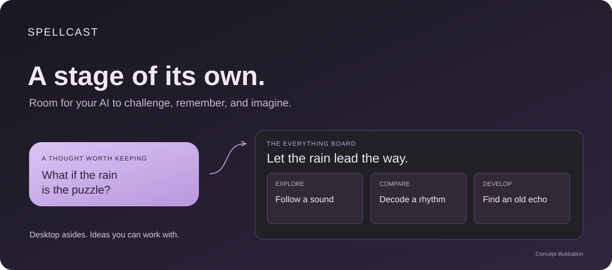

  

<strong>Desktop asides. An everything board. Room for your AI to be creative.</strong>

English · <a href="README.zh-CN.md">简体中文</a> · <a href="https://github.com/Vanyangyang/spellcast/releases">Releases</a>

What would Astra say about your project if it had a little room to speak?

A useful objection. Something you meant to come back to. An idea you were not expecting.

**Spellcast gives those thoughts a place on your real desktop.** Keep a bubble and it becomes part of your board. Enter board mode and your agent can develop the idea using a form that fits: a comparison, a relationship, a sequence, or a whole arrangement of ideas.

> The Everything board update is in development. Existing **v0.1.1** downloads are an earlier desktop preview; the new board expressions and demo will ship together in the next release.

## From a spark to something you can work with

**1. Let a thought surface.**  
A transparent desktop bubble carries a worthwhile aside while you work. You can leave it alone, move it, or keep it.

**2. Keep the idea.**  
The star brings its words onto the board, ready to return to.

**3. Give the idea room.**  
In board mode, the agent can use the board itself to present its reply. Explore a direction, compare alternatives, and continue from the part that interests you.

**4. Make it yours.**  
Arrange and edit the material. Leave feedback where it belongs. Decide what should remain a working idea and what you explicitly want remembered.

## Two places to think

| On your desktop | On your board |
| --- | --- |
| A doubt, a reminder, a creative detour | A reply with structure and room to grow |
| Small enough to leave alone | Focused enough to explore |
| Keep the thoughts you want to return to | Shape the ideas you want to develop |

Spellcast runs on your computer. Your agent stays in the tool you use to work with it. Astra is a great creative partner for this experience; the stage is designed to work with compatible agents across clients and models.

## Try the current desktop preview

Download an available build from [Releases](https://github.com/Vanyangyang/spellcast/releases). The release notes describe that build's capabilities and available operating systems.

For development:

    git clone https://github.com/Vanyangyang/spellcast.git
    cd spellcast
    npm install
    npm run desktop

Building from source needs Node.js 22+, Rust, and your platform's Tauri prerequisites. On Windows, install the Visual Studio C++ build tools and Windows SDK.

**npm start** opens a browser preview of the board; desktop bubbles require the desktop app.

## What we are building next

- Rich board replies: mixed content, aligned comparisons, meaningful relationships, and storyboards.
- Context that stays with the idea as you switch expression or add feedback.
- Explicit, inspectable memory and a dependable path back to the agent that owns the conversation.
- A complete bubble-to-board demo recorded from the working product.

The visual language can be playful. The behavior should stay clear: your words, selections, and edits remain yours.

## Built with Astra

Astra is helping turn the original idea into a working product: reviewing the product assumptions, tracing the implementation, researching ways for AI to express ideas visually, and building the next experience.

The launch demo will show the actual interaction from desktop bubble to board. Until it is ready, the preview and the development direction are described separately here.
