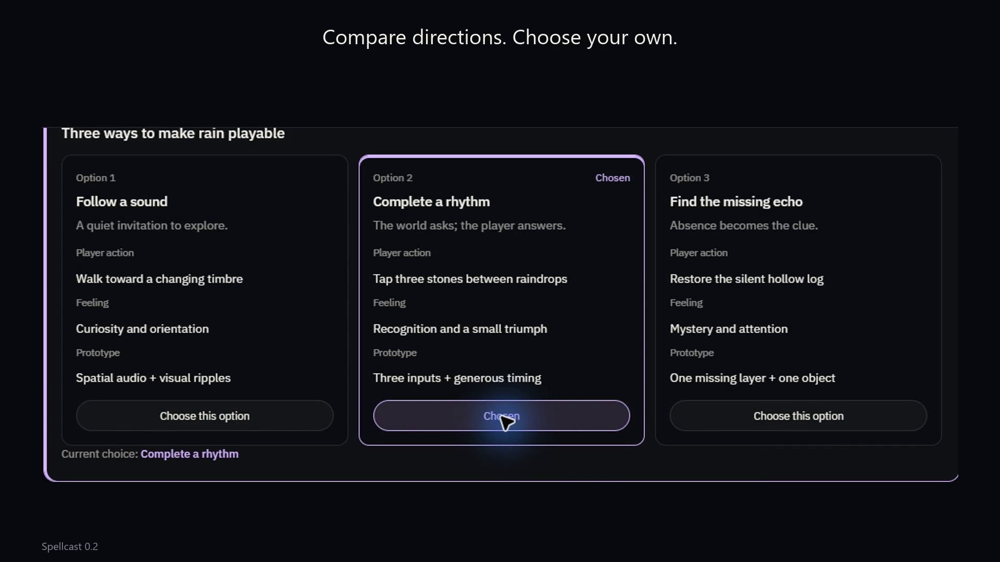

# Spellcast

**An everything board for AI.**

> **Spellcast is in early development.** Early demo · Experimental preview.
> What you see here is a preview build for trying the idea, not a finished product. Stay tuned for the full release.

Want Astra to roast your project? Remember what you meant to come back to? Give you an idea you were not expecting?

Your agent keeps working on your task. Its asides appear as bubbles on the display you are currently using, above your work without bringing the agent window forward. Keep a thought, bring it onto the board, and develop it with text, comparisons, relationships, and storyboards.

[English](README.md) · [简体中文](README.zh-CN.md) · [Download the preview (Windows / macOS)](https://github.com/Vanyangyang/spellcast/releases/latest)

[](https://github.com/Vanyangyang/spellcast/releases/download/v0.2.0/spellcast-demo.mp4)

**[Watch the desktop demo](https://github.com/Vanyangyang/spellcast/releases/download/v0.2.0/spellcast-demo.mp4)** — task-related bubbles while you keep working, then adoption, board replies, and feedback. Recorded in the real Windows app and edited for pacing. A new recording with the current bubble interactions is in progress.

## Where the preview stands

- **Published build:** [0.2.0](https://github.com/Vanyangyang/spellcast/releases/tag/v0.2.0) — Windows x64 installer plus Apple Silicon and Intel `.dmg`. Windows is the only platform verified by hand; the macOS builds only passed CI packaging.
- **In `main`, not yet in a build:** bubbles follow the display of your foreground window; a kept bubble stays where you drop it, an unkept one pauses five seconds after a drag and then keeps rising; double-clicking a bubble opens exactly that thought on the board. Real-input acceptance of these is tracked in [docs/reviews](docs/reviews/2026-09-06-bubble-acceptance-record.md).
- **Expect rough edges.** Layout, copy, and the agent Skill are still changing between previews. Feedback and issues are welcome.

## From a spark to something you can work with

1. **A thought meets you where you work.** Your agent's task supplies the context; your foreground window determines the display. A sparse bubble carries an objection, a reminder, or a creative detour. Leave it alone, drag it, or open it.
2. **Keep the idea.** The star saves its words onto your board, with the originating task attached.
3. **Give it room.** Ask the agent to develop it. The board becomes the reply surface, with a composition that fits the idea.
4. **Make it yours.** Choose a direction, edit a block, move a relationship, or add a constraint. Your feedback returns to the task that owns it.

| Expression | What you can do |
| --- | --- |
| Text | Read complete explanations, edit them, and ask about a specific block |
| Comparison | Inspect alternatives against the same criteria and choose one |
| Relationship graph | Follow labeled connections, inspect nodes, drag, pan, and zoom |
| Storyboard | Explore ordered steps, their actions and feedback, and reorder them |

Replies can mix these forms. Agents can update one block without replacing everything else. Conflicting edits are rejected so your draft can be reconciled instead of silently overwritten.

Switch to another application and desktop bubbles resume while the board keeps its mode and content. An explicit pause remains paused.

## Your agent stays where it already works

Spellcast is a local desktop app, connected through MCP. It does not run a model or require a model API key. Your agent continues to use its existing host and model.

Feedback remains queued until the originating task reads and acknowledges it. **An inactive host is not automatically awakened.** The bundled Skill teaches the agent when to check feedback, when a bubble is worth showing, and when to reply on the board.

Kept ideas and replies survive restart. Durable memory is separate: save only what you choose, inspect it in **Memory**, search it, and forget individual entries. Keeping a bubble does not automatically create a memory.

## Get started

1. Download and run the latest **Windows x64 preview build** from [Releases](https://github.com/Vanyangyang/spellcast/releases/latest), or build from source (below) to get everything in `main`.
2. Open **Settings**, choose your host, and review its MCP configuration. Supported writers merge only Spellcast's entry and back up the original file. Other hosts get a configuration snippet.
3. Install the bundled **Skill**, reload your host's agent, and ask it to use Spellcast.

The desktop app must be running. Its local MCP endpoint is `http://127.0.0.1:47194/mcp`. Connection setup supports Cursor, Codex, Windsurf, Claude Code, and generic MCP clients; runtime behavior still depends on the host's tool and lifecycle support.

Apple Silicon and Intel macOS builds are produced by the same release workflow. They passed CI packaging; [runtime verification is currently Windows-only](docs/releases/0.2.1.md).

## Develop locally

```sh
git clone https://github.com/Vanyangyang/spellcast.git
cd spellcast
npm ci
npm run desktop
```

Use Node.js 22+, the repository's Rust toolchain, and the platform's Tauri prerequisites. Windows builds require Visual Studio C++ build tools, Windows SDK, and WebView2.

`npm start` opens a browser preview of the board. OS bubbles require `npm run desktop` or the installed app.

```sh
npm run build
cargo test --workspace
cargo test --manifest-path src-tauri/Cargo.toml --lib
npm run tauri -- build --bundles nsis
```

## Built with Astra

Astra helped challenge the product assumptions, build and integrate the bubble → board → feedback loop, test the interactions, and produce this demo. The graph canvas uses [AntV X6](https://github.com/antvis/X6); the desktop shell uses [Tauri](https://github.com/tauri-apps/tauri).

[Agent behavior](skills/spellcast/SKILL.md) · [Release notes and verification](docs/releases/) · [MIT license](LICENSE)
