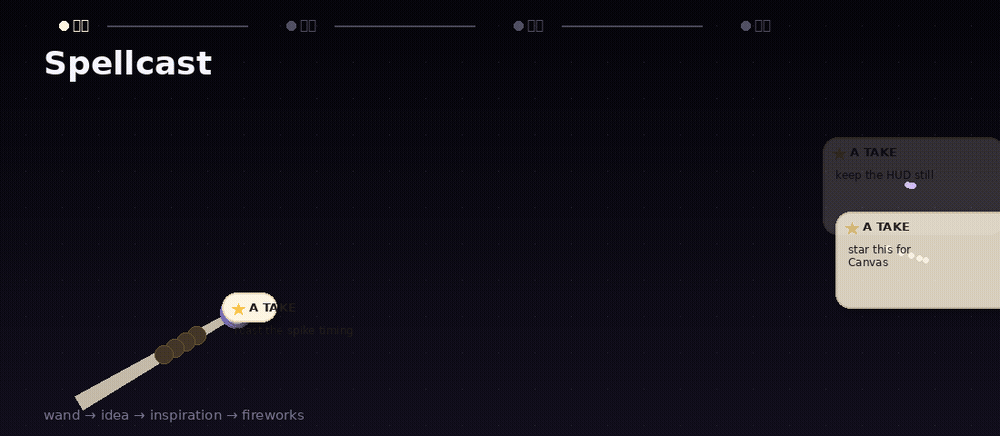
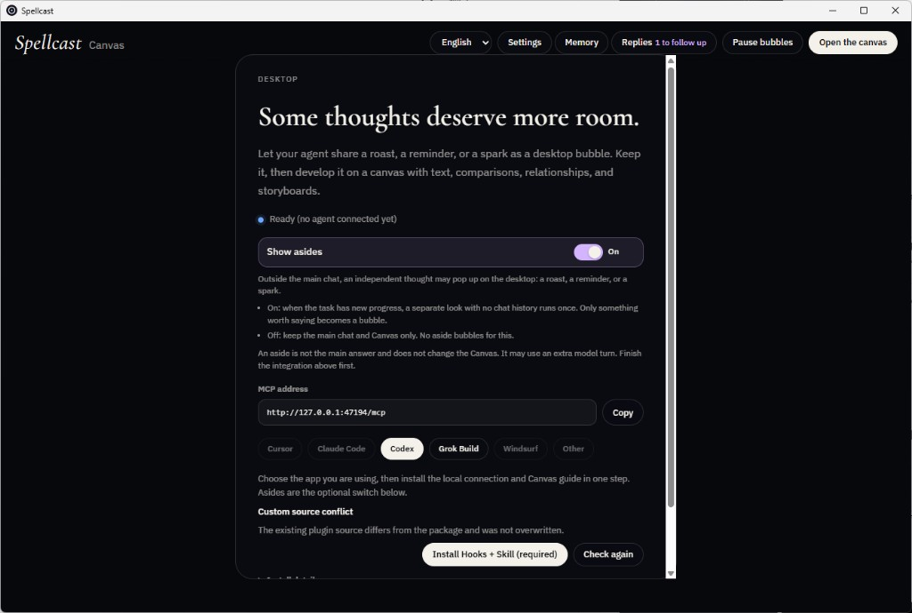
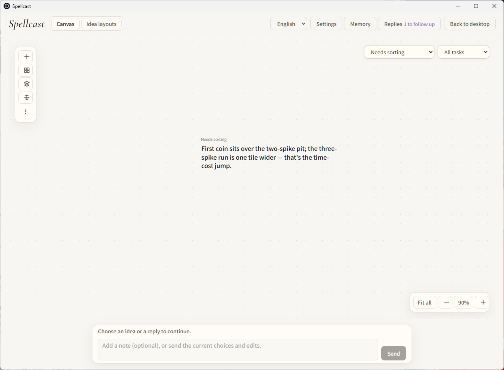
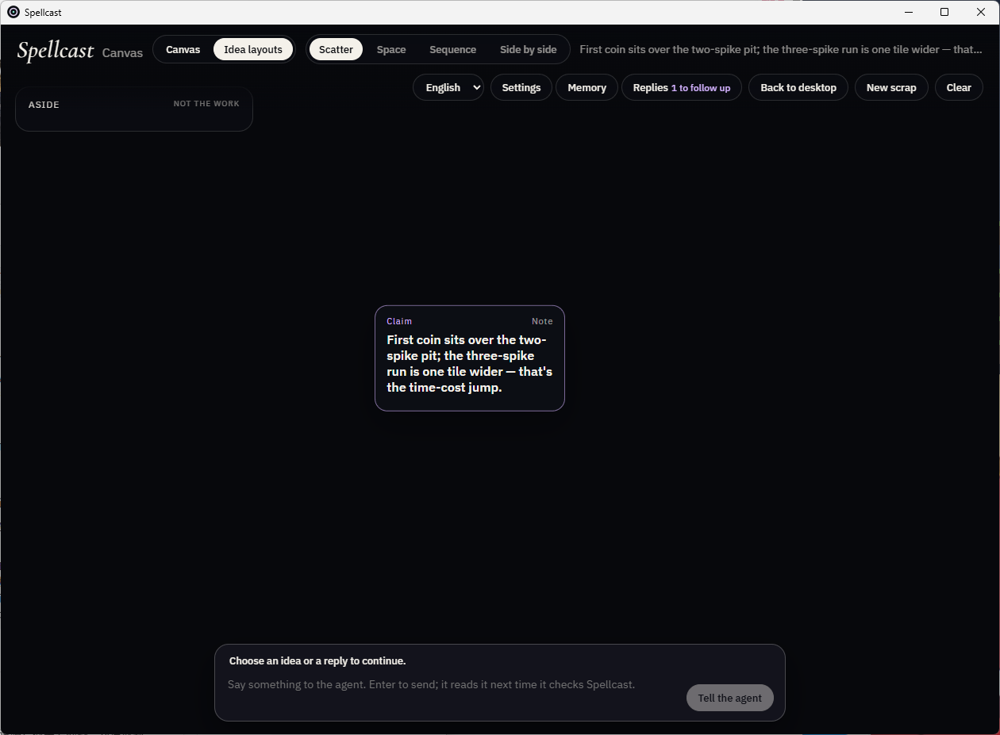
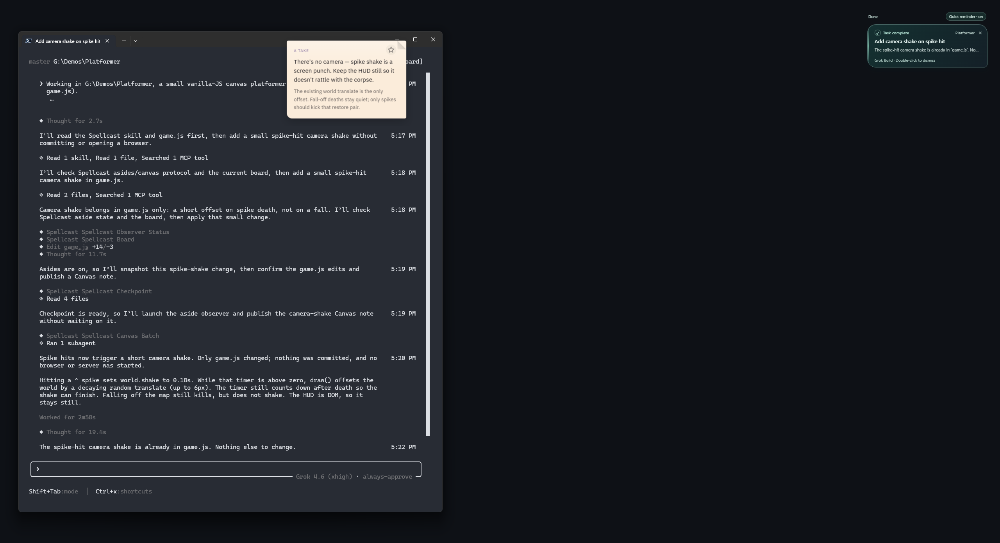
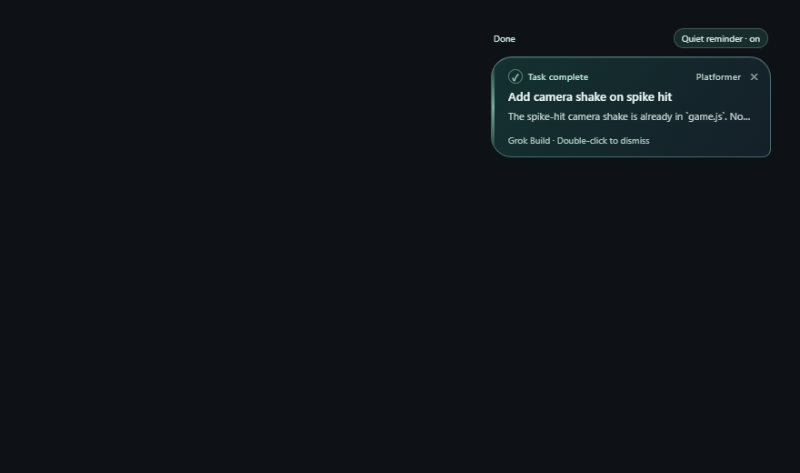

# Spellcast



**A stage of its own.** Desktop asides, a Canvas for ideas you can develop, and completion notices for Codex and Grok Build. Sending a request back to the original task still uses Codex Desktop.

> **Spellcast is in early development.** Early demo · Experimental preview.
> What you see here is a preview build for trying the idea, not a finished product. Stay tuned for the full release.

Want Astra to roast your project? Remember what you meant to come back to? Give you an idea you were not expecting?

Your agent keeps working on your task. Its asides appear as bubbles on the display you are currently using, above your work without bringing the agent window forward. Keep a thought, bring it onto the Canvas, and develop it with text, images, comparisons, relationships, steps, and interactive works.

[English](README.md) · [简体中文](README.zh-CN.md) · [Download the preview (Windows only tested)](https://github.com/Vanyangyang/spellcast/releases/latest)

[](https://www.producthunt.com/products/spellcast?embed=true&utm_source=badge-featured&utm_medium=badge&utm_campaign=badge-spellcast)

## How it looks

This is an early preview, not a finished product. The path that is **supported and tested today is Codex on Windows.** Unsigned macOS builds exist from CI; they have not been run.

**Bubbles and asides are passive.** There is no “spawn bubble” button. With **Show asides** on, the running agent session may produce a desktop bubble when something is worth saying — a roast, a reminder, or a spark. Silence is a valid outcome. Hooks do not guarantee a bubble on every turn. Steps 4 and 5 below are **Grok Build on Windows** shots of that same bubble and completion-notice UI, not Codex.

1. **Turn asides on for Codex**

   

   Desktop settings with **Show asides** On and **Codex** selected. The copy is explicit: when the task has new progress, a separate look runs once, with no chat history; only something worth saying becomes a bubble. Off keeps the main chat and Canvas only.

2. **A result on the Canvas**

   

   An idea under **Needs sorting**. The agent placed this on the Canvas when the thought was worth keeping — not because you pressed a spawn button.

3. **Claim, note, and tell the agent**

   

   A **Claim** or **Note** on the Canvas, plus **Tell the agent**. That bar sends a follow-up into the session. It does not create bubbles.

4. **A floating desktop bubble**

   

   A passive **TAKE** bubble over the real desktop / TUI. This shot is **Grok Build on Windows** — the same aside UI, not Codex. There is still no spawn button; the running session produced the bubble.

5. **A completion notice**

   

   A completion card with an optional spoken alert. The footer shows **Grok Build**; double-click dismisses the card. This shot is Grok Build, not Codex.

## Where the preview stands

- **Published build:** [0.4.5](https://github.com/Vanyangyang/spellcast/releases/tag/v0.4.5) — Windows x64 installer. **Windows is the only tested platform.** The release workflow can also attach unsigned macOS `.dmg` files; they are not guaranteed to work. See [0.4.5 notes](docs/releases/0.4.5.md) and the [0.4.0 workbench notes](docs/releases/0.4.0.md).
- **Current source and locally tested Windows runtime:** editable Canvas components and named Idea compositions; workspace/task organization; direct feedback to the original Codex Desktop task; one-step **Codex** integration (MCP + Hooks + Skill); a request-based replies panel. **Grok Build setup will be added in a future version** (the Settings button is visible but disabled). See [runtime acceptance](docs/reviews/2026-09-14-workbench-runtime-acceptance.md) and [replies](docs/reviews/2026-09-15-replies-inbox.md). [Codex-only setup](docs/reviews/2026-09-15-codex-only-entry.md) matches this preview’s install UI.
- **Known gaps:** component granularity is not uniform, a component cannot belong to multiple Idea compositions, and historical requests with incomplete provenance need clearer classification. The replies/history interface still needs simplification. See [the next improvement brief](docs/next-improvement-prompt.md).
- **Expect rough edges.** Layout, copy, and the agent Skill are still changing between previews. Feedback and issues are welcome.

## From a spark to something you can work with

1. **A thought meets you where you work.** Your agent's task supplies the context; your foreground window determines the display. A sparse bubble carries an objection, a reminder, or a creative detour. Leave it alone, drag it, or open it.
2. **Keep the idea.** The star saves its words onto your Canvas, with the originating task attached when known.
3. **Give it room.** Combine components into an Idea with a title and purpose. The Canvas becomes the reply surface, with a composition that fits the idea.
4. **Make it yours.** Choose a direction, edit components, or add a constraint. These changes stay on the Canvas until you explicitly click **Send to Codex**; the request then goes to its original task. Redirecting it requires confirmation.

| Expression | What you can do |
| --- | --- |
| Text | Read complete explanations, edit them, and ask about a specific block |
| Images and shapes | Arrange reference images, rectangles, ellipses, and annotations |
| Comparison | Inspect alternatives against the same criteria and choose one |
| Relationship graph | Follow labeled connections, inspect nodes, drag, pan, and zoom |
| Storyboard | Explore ordered steps, their actions and feedback, and reorder them |
| Interactive works | Use locally stored Web tools supplied by the agent, with declared inputs and outputs |

Ideas can combine these forms, with ordered members and nested compositions. Each member currently belongs to one composition. Agents can update individual content; version conflicts and protected user edits become reviewable proposals. Data connections are limited to declared work outputs feeding text or another work's input, not arbitrary connections between all components.

Switch to another application and desktop bubbles resume while the Canvas keeps its mode and content. An explicit pause remains paused.

## Your agent stays where it already works

Spellcast is a local desktop app, connected through MCP. It does not run a model or require a model API key. Your agent continues to use its existing host and model.

An explicit Canvas submission goes directly to the corresponding task through the running **Codex Desktop** app, including an idle task. The result can update the original Canvas content. A closed app, deleted task, unavailable tools, or failed delivery is not reported as successful execution. Codex integration includes MCP, Hooks, and behavior guidance; receiving a request and completing it are tracked separately. Grok Build setup is not in this preview.

**Completion notices** appear as a small always-on-top card on the display you are using, with an optional spoken alert ("A Codex task is ready." / "Codex 有任务完成了。" following the UI language). A Codex card double-clicks back into the originating task in Codex Desktop; a Grok Build card is dismissed by double-click. The UI is available in English and Simplified Chinese; the card, the spoken phrase, and the setup page follow the same setting.

**Independent asides** follow the switch in Spellcast. With asides enabled, the host supplies brief context when substantive new project information appears. A fresh isolated observer decides whether there is anything useful to add; silence is valid. This needs host support for isolated subagents and native MCP tools. Hooks do not guarantee an aside on every turn, and no separate model service is installed. See [Codex hooks and verification boundaries](docs/codex-observer-hooks.md).

Kept ideas and replies survive restart. Durable memory is separate: save only what you choose, inspect it in **Memory**, search it, and forget individual entries. Keeping a bubble does not automatically create a memory.

## Get started


1. Build the current source (below) for the workflow described here, or install the [published Windows preview](https://github.com/Vanyangyang/spellcast/releases/latest).
2. For **Codex**, open **Settings**, keep Codex selected, and install or update the Spellcast integration. This writes MCP, Hooks, and the behavior Skill together, with backups and conflict checks. Reload Codex and follow any Hooks trust instructions shown by the integration status.
3. **Grok Build will be added in a future version.** The Settings button remains visible but cannot install.
4. Enable independent asides using the Spellcast switch when desired (Codex Hooks are what can start them).

Integration details: [docs/codex-observer-hooks.md](docs/codex-observer-hooks.md) and the packaged [hooks/INSTALL.md](hooks/INSTALL.md).

The Spellcast app must be running. Its local MCP endpoint is `http://127.0.0.1:47194/mcp`. **The setup UI currently supports Codex.** Grok Build, Cursor, Claude Code, Windsurf, and Other remain visible but disabled.

The release workflow also produces Apple Silicon and Intel macOS builds plus Linux AppImage and `.deb` packages, but [only Windows has been tested](docs/releases/0.4.5.md). The macOS `.dmg` files are unsigned and unverified; expect Gatekeeper warnings and possible runtime failures. The Linux packages are CI packaging output and have not been runtime-tested.

## Develop locally

```sh
git clone https://github.com/Vanyangyang/spellcast.git
cd spellcast
npm ci
npm run prepare:codex-plugin
npm run desktop
```

Use Node.js 22+, the repository's Rust toolchain, and the platform's Tauri prerequisites. Windows builds require Visual Studio C++ build tools, Windows SDK, and WebView2. Linux builds need WebKitGTK 4.1 and the other packages from the [Tauri 2 Linux prerequisites](https://v2.tauri.app/start/prerequisites/#linux).

`npm start` opens a browser preview of the Canvas. OS bubbles require `npm run desktop` or the installed app. `npm run desktop` / `tauri dev` hot-reload against Vite at `http://127.0.0.1:47193`; without Vite, that debug process shows `ERR_CONNECTION_REFUSED`. For a double-clickable local runtime, build a self-contained debug exe with `npx tauri build --debug --no-bundle` (`src-tauri/target/debug/spellcast.exe`; the desktop shortcut on this machine already points there). Browser acceptance scripts under `scripts/` include local development harnesses; some require the Codex-bundled Playwright runtime. Their fixture results are not proof of a real Codex model turn.

```sh
npm run build
cargo test --workspace
cargo test --manifest-path src-tauri/Cargo.toml --lib
npm run tauri -- build --bundles nsis
# Linux: npm run tauri -- build --bundles appimage,deb
```

## Built with Astra

Spellcast was built with GPT-6 Astra. Astra challenged the product assumptions, wrote the Rust core and the Tauri shell, integrated the bubble → Canvas → feedback loop, and used computer use to test the desktop interactions end-to-end and produce the demos. The graph canvas uses [AntV X6](https://github.com/antvis/X6); the desktop shell uses [Tauri](https://github.com/tauri-apps/tauri).

[Agent behavior](skills/spellcast/SKILL.md) · [Release notes and verification](docs/releases/) · [AGPL-3.0 license](LICENSE)
