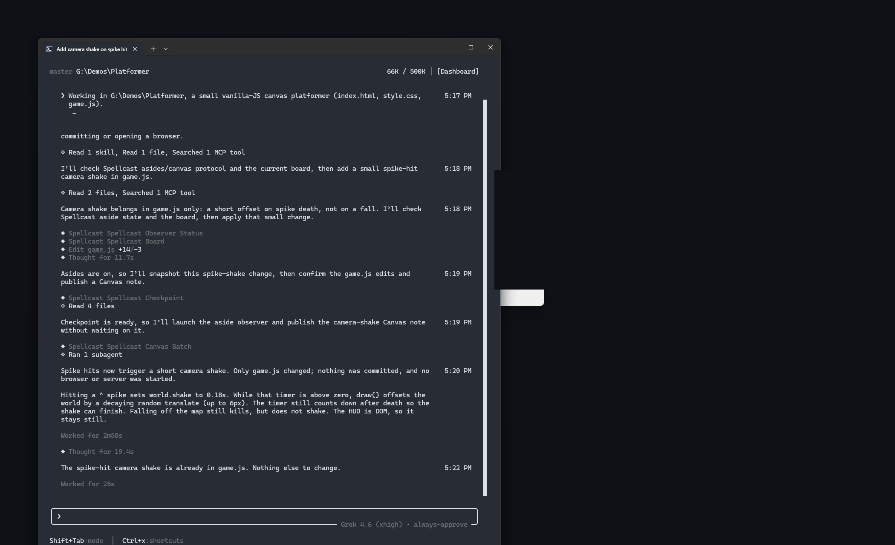

# Spellcast


**对话之外的舞台。** 桌面旁念、用来发展想法的画布，以及 Codex 与 Grok Build 的完成提醒。把请求直接回发到原任务仍走 Codex Desktop。

> **Spellcast 仍在孵化中。** 这是初期演示 demo，目前提供的是体验测试版本，不是成品；成品敬请期待。
> Early demo · Experimental preview · Stay tuned for the full release.

想听听你的 Astra 对项目有什么吐槽？想让它帮你记起忙着忙着忘掉的事？想接住一次意料之外的灵光一闪？

试试 **Spellcast**。Agent 继续处理你的任务，与任务相关的吐槽、提醒和灵感，会从你当前操作的显示器上冒出来，不必切回 Agent 窗口。喜欢哪个，就收进画布，用文字、图片、对比、关系图、步骤和交互作品继续展开。

[English](README.md) · 简体中文 · [下载体验版（仅 Windows 经过测试）](https://github.com/Vanyangyang/spellcast/releases/latest)

[](https://www.producthunt.com/products/spellcast?embed=true&utm_source=badge-featured&utm_medium=badge&utm_campaign=badge-spellcast)

## 现在长什么样

**当前支持并经过测试的路径是 Codex + Windows。** macOS 未经测试。

**旁念和气泡是被动的。** 没有“生成气泡”按钮。打开**显示旁念**后，只会借助宿主**子代理**抛出旁念，只占用主进程一小部分资源；有值得说的才冒出桌面气泡——一句吐槽、提醒或灵感。保持安静也是正常结果。Hooks 不保证每一轮都会冒泡。

1. **先为 Codex 打开旁念**

   

   桌面设置里 **显示旁念** 为开，并选中 **Codex**。关掉则只留主对话和画布。

2. **画布上的结果**

   

   **待整理**里的一条 Idea。这是 Agent 觉得值得留下时放到画布上的，不是你按按钮生成的。画布功能目前仍在积极开发中，欢迎提出建议；现在就能用多种形式把想法表现出来。后期可能开一个画布专注模式：不计成本，加速创意工作。

3. **主张、批注，再说给 Agent**

   

   画布上的 **主张** 或 **批注**，以及 **说给 Agent**。这条输入栏用来回会话，不会生成气泡。

4. **桌面上的旁念气泡**

   

   一段 **Grok Build** TUI 会话，TAKE/旁念气泡正在冒出来。仍然没有“生成气泡”按钮，气泡由正在进行的会话自己冒出来。收藏之后会常驻顶端；不点收藏，会自动消散。可以自行拖动这个气泡。

5. **完成提醒**

   

   完成提醒卡片，可选语音播报。页脚显示 **Grok Build**；双击关闭。

## 体验版现在到哪了

- **已发布的构建：** [0.4.7](https://github.com/Vanyangyang/spellcast/releases/tag/v0.4.7)，含 Windows x64 安装包。详见 [0.4.7 说明](docs/releases/0.4.7.md)。
- **本预览：** 可编辑画布 Idea、按工作区和任务整理、回发原 Codex Desktop 任务、Codex 一键接入（MCP + Hooks + Skill）。**Grok Build 接入稍后加入**（设置里按钮仍显示，但不可安装）。详见[运行验收](docs/reviews/2026-09-14-workbench-runtime-acceptance.md)、[回复面板](docs/reviews/2026-09-15-replies-inbox.md)、[仅 Codex 接入](docs/reviews/2026-09-15-codex-only-entry.md)。
- **会有毛边。** 版式、文案和 Skill 还在变，欢迎反馈和提 issue。详见[下一步改善提示词](docs/next-improvement-prompt.md)。

## 一个念头，如何长成可以继续创作的东西

1. **在你工作时冒出来。** 想法来自 Agent 正在处理的任务，显示位置跟随你当前的前台窗口。值得留意的吐槽、提醒和创意岔路，以稀疏的气泡出现。可以忽略、拖动或打开。
2. **收进来。** 点亮星标，把内容放进画布，保留已知的原任务来源。
3. **展开它。** 把组件组合成有标题、有意图的 Idea。画布成为完整回复的呈现面，由内容决定适合的表达形式。
4. **变成你的。** 选方向、改组件、补充约束。这些操作先保留在画布中，最后点击**发送到 Codex**，才回发原任务；改发其他任务需要确认。

| 表达形式 | 可以怎样继续 |
| --- | --- |
| 文字 | 阅读完整说明，修改内容，针对一块追问 |
| 图片与图形 | 排列参考图、矩形、椭圆和注释 |
| 方案对照 | 用相同标准比较方向，明确选中一个方案 |
| 关系图 | 阅读带标签的连线，查看节点详情，拖动、平移与缩放 |
| 分镜 | 按顺序探索动作、反馈和说明，也可以调整顺序 |
| 交互作品 | 操作 Agent 提供并在本地保存的 Web 工具，使用其声明的输入输出 |

一个 Idea 可以组合这些形式。切去其他应用后桌面气泡会恢复投放；手动暂停则会持续生效。

## Agent 留在你原本使用的地方

Spellcast 是通过 MCP 连接的本地桌面应用，不运行模型，也不需要填写模型 API Key。Agent 继续使用原来的宿主和模型。

明确发送后，请求交给运行中的 **Codex Desktop** 里对应任务，包括当前空闲的任务。投递失败不会显示为已成功。本预览不含 Grok Build 接入。

**完成提醒**是一张置顶小卡片，可选语音播报（跟随界面语言）。Codex 卡片双击回跳原任务；Grok Build 卡片双击关闭。

**独立旁念**以 Spellcast 开关为准，由宿主子代理抛出，只占用主任务一小部分资源。详见[Codex Hooks 与验证边界](docs/codex-observer-hooks.md)。

采纳的想法和画布回复可以跨重启保留。长期记忆是另一项明确操作：你决定记住什么，在 **记忆** 中查看、搜索和逐条遗忘。收藏气泡不会自动建立长期记忆。

## 开始使用


1. 按下文从当前源码运行，或安装[公开的 Windows 体验版](https://github.com/Vanyangyang/spellcast/releases/latest)。
2. **Codex：** 打开**设置**，保持选中 Codex，安装或更新 Spellcast 接入。一次写入 MCP、Hooks 和行为 Skill，并完成备份及冲突检查。然后重载 Codex，按接入状态中的提示信任 Hooks。
3. **Grok Build 将在未来版本加入。** 设置里仍能看到按钮，但无法安装。
4. 需要独立旁念时，在 Spellcast 中打开旁念开关（能自动拉起旁念的是 Codex Hooks）。

接入详情：[docs/codex-observer-hooks.md](docs/codex-observer-hooks.md) 与包内 [hooks/INSTALL.md](hooks/INSTALL.md)。

使用期间需要保持 Spellcast 运行。本地 MCP 为 `http://127.0.0.1:47194/mcp`。**接入界面当前支持 Codex。** 设置里其他宿主仍显示，但不可安装。macOS 与 Linux 的 CI 包未经测试。

## 本地开发

```sh
git clone https://github.com/Vanyangyang/spellcast.git
cd spellcast
npm ci
npm run prepare:codex-plugin
npm run desktop
```

需要 Node.js 22+、仓库配置的 Rust 工具链及 Tauri 平台构建环境。Windows 需要 Visual Studio C++ 构建工具、Windows SDK 和 WebView2。Linux 需要 WebKitGTK 4.1 以及 [Tauri 2 Linux 依赖](https://v2.tauri.app/start/prerequisites/#linux) 中的其余软件包。

`npm start` 打开画布的浏览器预览；桌面气泡需要 `npm run desktop` 或已安装的应用。`npm run desktop` 依赖本机 Vite `http://127.0.0.1:47193`。本机 debug 可执行文件：`npx tauri build --debug --no-bundle`。

```sh
npm run build
cargo test --workspace
cargo test --manifest-path src-tauri/Cargo.toml --lib
npm run tauri -- build --bundles nsis
# Linux: npm run tauri -- build --bundles appimage,deb
```

## Astra 如何参与

Spellcast 由 GPT-6 Astra 参与构建。Astra 检查产品理解，编写 Rust 核心与 Tauri 外壳，整合气泡 → 画布 → 反馈更新的流程，并用 computer use 端到端验证桌面交互、制作演示。关系图使用 [AntV X6](https://github.com/antvis/X6)，桌面外壳使用 [Tauri](https://github.com/tauri-apps/tauri)。

## 友情链接

- [LINUX DO](https://linux.do) — 新的理想型社区

[Agent 行为说明](skills/spellcast/SKILL.md) · [版本说明与验证记录](docs/releases/) · [AGPL-3.0 许可证](LICENSE)
