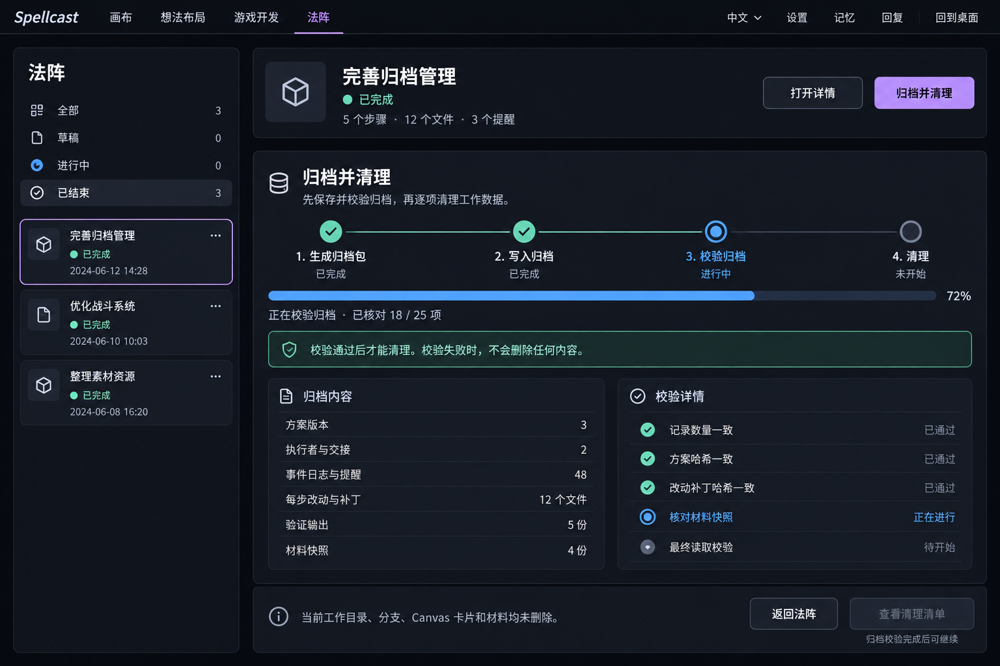
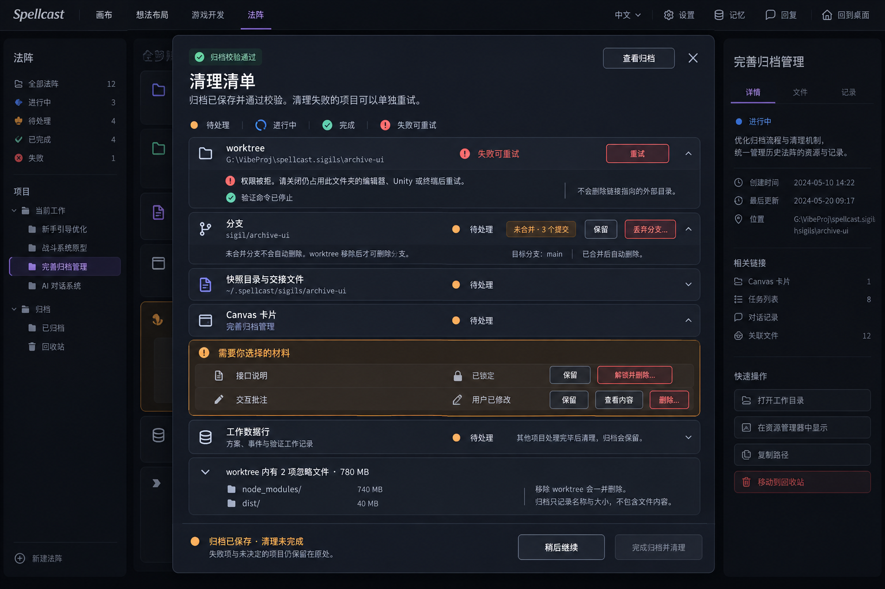
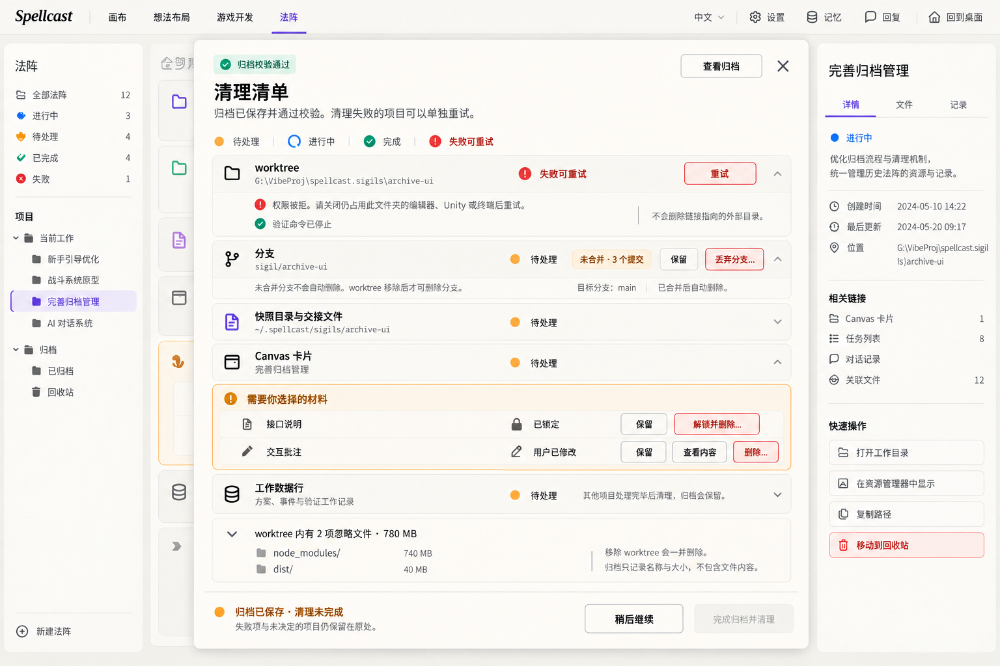
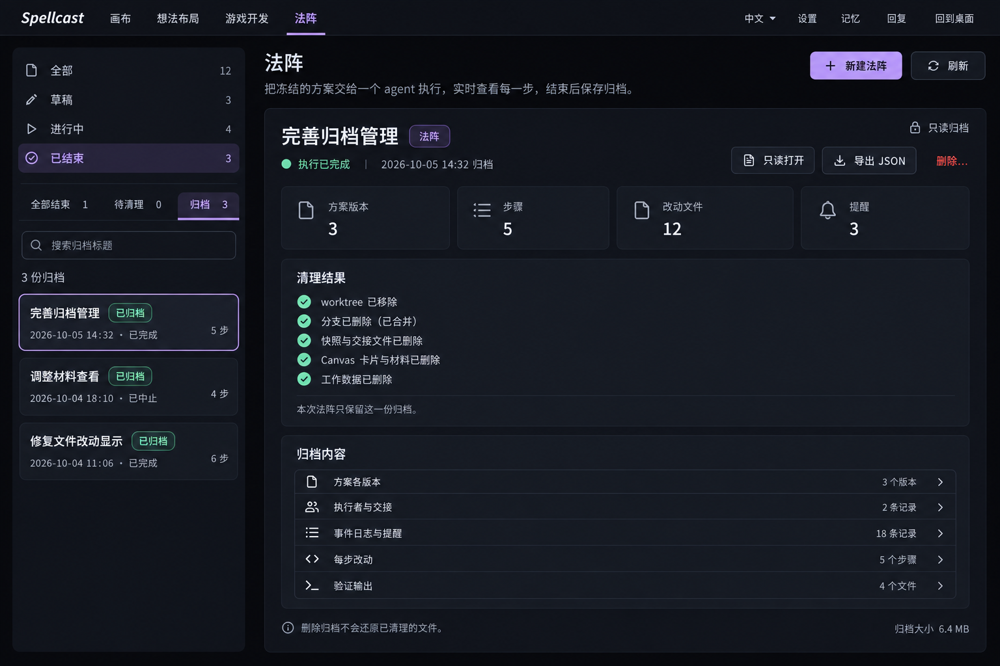
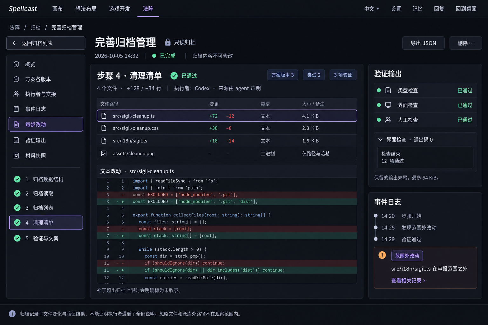
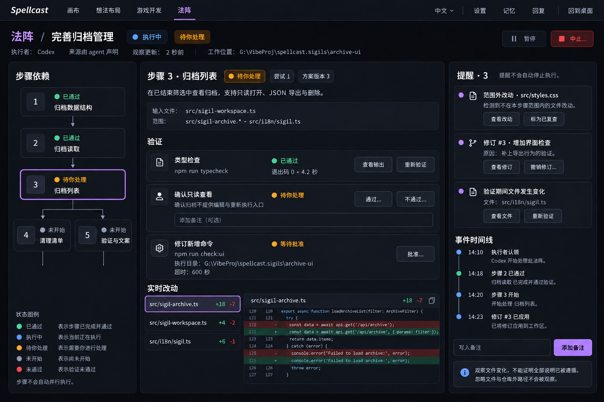
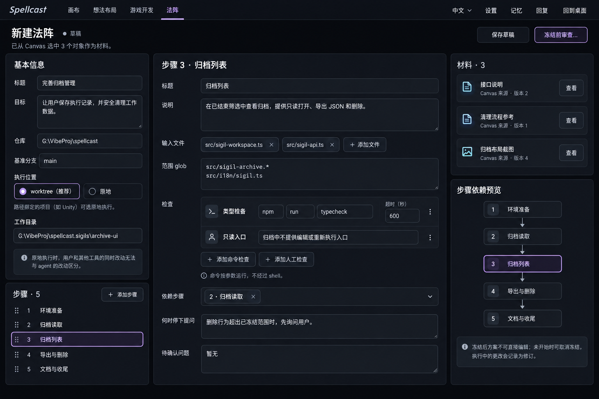
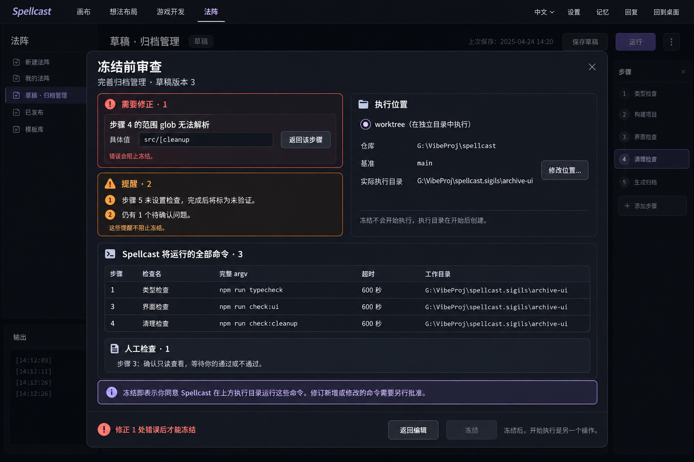

# 法阵（Sigil）界面设计稿

本目录交付 8 张宿主 GPT 图片生成工具制作的高保真 PNG：7 张深色主题、1 张浅色主题。它们是设计提案，不是已实现界面的截图。图中的标题、路径、版本、数量、输出和时间均为演示数据；命令仅是图中例子，本任务没有执行任何命令检查。

- 权威依据：[法阵阶段一合同](../../sigil-phase1-contract.md)，重点为 Terms、Lifecycle、Plan、Interface、Archive and clean up、Limits shown to the user。
- 视觉参考：`artifacts/spellcast-sigil-card/` 的深浅色工作区、失败检查、命令批准、修订、diff 对话框截图；[卡片样式](../../../src/sigil-card.css)、[工作区样式](../../../src/sigil-workspace.css) 与 `src/styles.css` 的色值。
- 实际生图工具：宿主内置 `image_gen.imagegen`，在工具编排中调用 `tools.image_gen__imagegen`。没有用 HTML、SVG、浏览器截图或绘图代码替代生图。
- 生成次数：10 次内置工具调用，包含 7 次新图生成与 3 次图片编辑。第 03 张进行了主题转换和一次文字色对比度修正；第 06 张进行了一次业务表达修正。最终只交付 8 张采用稿，不堆放未采用变体。
- 提示词要求画布为 1536 × 1024，窗口宽 1536，属于 1320–1600 的桌面范围；实际尺寸以交付 PNG 元数据和文末记录为准。
- 精确中文文案以本文为准。生成图片中的错字、字形粘连与参数变形不能作为实现依据。

## 共同的布局与交互约定

延续当前顶部入口和左侧列表 / 右侧详情结构，不另建导航体系。卡片使用 8 / 12 px 圆角，8 / 12 / 16 / 24 px 间距，34 px 常规控件，正文目标 14–16 px。只在“法阵”功能标识、选中边框和局部操作上使用现有淡紫色；不出现主题化阶段词、魔法图案、符文、光效或游戏 UI。

深色采用现有 `#07080c / #12141c / #181b24` 表面与 `#f4f1ea` 正文；浅色沿用参考图的暖白表面、`#1c1a16` 正文和 `#5c574e` 辅助文字。彩色文字向正文色混合以保持可读性。正文与辅助文字的目标对比度均 ≥ 4.5:1；这属于设计目标，生成位图不构成浏览器或原生应用的可访问性验证。

状态同时使用状态点 / 图标和中文文字。步骤状态准确文案：**未开始、可开始、进行中、待验证、已通过、已完成（未验证）、未通过、待你处理、已跳过**。执行生命周期准确文案：**草稿、已冻结、执行中、已暂停、已完成、已中止、已归档**。操作沿用：**冻结、执行、认领、修订、验证、提醒、归档并清理**。提醒不是步骤状态，也不会自动停止执行。

只在“已完成”或“已中止”的法阵上提供“归档并清理”。冻结、开始执行、归档清理仍分别由用户决定；这些设计不增加 agent 可代用户点击的入口。

### 尚待决定的边界

合同同时要求“归档后只保留归档”和“允许用户保留未合并分支、锁定或用户修改的材料”。本稿采用保守呈现：归档保存成功与清理完成分开显示；只要仍有保留对象，显示 **归档已保存 · 清理未完成**，原法阵保留“已完成 / 已中止”的生命周期，不能宣称“已归档”。这不是新增生命周期。是否把用户明确保留视为清理已结束，需用户拍板并相应澄清合同；目前没有按设计默默放宽“只剩归档”的定义。

工作数据行排在最后，失败项、待决定项以及明确保留项的清理记录必须仍可重新打开，不能删掉唯一的重试入口。归档已经保存可只读查看，并标明清理尚未完成。不能因清理失败创建重复归档。

### 图片索引

| 文件 | 用途 |
|---|---|
| [01-archive-cleanup-dark.png](01-archive-cleanup-dark.png) | 归档生成、写入、回读校验与清理安全门 |
| [02-cleanup-checklist-dark.png](02-cleanup-checklist-dark.png) | 逐项清理、权限失败重试、分支和材料选择 |
| [03-cleanup-checklist-light.png](03-cleanup-checklist-light.png) | 同一清理清单的浅色主题 |
| [04-archive-list-dark.png](04-archive-list-dark.png) | 工作区内的归档列表与概览 |
| [05-archive-viewer-dark.png](05-archive-viewer-dark.png) | 归档内容的只读查看 |
| [06-step-panel-dark.png](06-step-panel-dark.png) | 依赖图、步骤详情、改动、验证、提醒和时间线 |
| [07-draft-editor-dark.png](07-draft-editor-dark.png) | Canvas 材料创建与草稿完整编辑 |
| [08-freeze-review-dark.png](08-freeze-review-dark.png) | 冻结前错误、警告、位置和全部命令审查 |

## 01 · 归档生成与校验



对应合同 **Archive and clean up 1–2、Lifecycle**；缺口 **1a**。

### 布局与交互

完成的法阵详情中就地展开归档进度，保留所选法阵和返回路径。四个阶段分别显示完成、进行中或未开始；进度只表示实际已完成的归档工作，不拿“运行已完成”冒充“清理已完成”。截图呈现回读校验进行中，清理入口禁用。校验失败切换为就近错误，不删任何工作内容，不启动清理。

归档应收录所有方案版本的作者与理由、执行者与交接、事件及提醒、每步统计与补丁、检查输出、材料快照、最终状态，以及 worktree 的分支末端、合并判断、忽略文件名称和大小。补丁总量 16 MiB，材料快照 8 MiB；二进制文件只收录路径与哈希，不能把归档描述成完整仓库备份。归档写入一份不可变记录，回读数量与哈希通过后才显示清理清单。

### 准确中文文案与状态

- 标题：**归档并清理**。
- 说明：**先保存并校验归档，再逐项清理工作数据。**
- 过程：**生成归档包、写入归档、校验归档、清理**；状态：**完成、进行中、未开始**。
- 当前：**正在校验归档 · 已核对 18 / 25 项**。
- 安全说明：**校验通过后才能清理。校验失败时，不会删除任何内容。**
- 栏目：**归档内容、校验详情**。
- 内容：**方案版本、执行者与交接、事件日志与提醒、每步改动与补丁、验证输出、材料快照**。
- 校验项：**记录数量一致、方案哈希一致、改动补丁哈希一致、核对材料快照、最终读取校验**。
- 底部：**当前工作目录、分支、Canvas 卡片和材料均未删除。**
- 操作：**返回法阵、查看清理清单**；后者禁用说明：**归档校验完成后可继续**。
- 失败替换文案：**归档校验失败**；**未删除任何内容，请重新生成并校验归档。**；按钮 **重新生成并校验、返回法阵**。不显示“继续清理”。

### 取舍与待决定问题

将“准备归档”和“清理”分成可辨认的两步，但只保留一个“归档并清理”入口，避免用户把点击入口理解为立即删除。失败态文案与禁用规则写入本文，未为单个错误态额外增加一张图。没有增加强制勾选框。

### 实际使用的生图提示词

```text
用途：ui-mockup，高保真桌面开发工具界面设计稿。
输出：一张全新的 PNG，整个应用窗口正面平视，画布 1536×1024（桌面窗口宽度 1536），无外围电脑、无透视、无海报边框。
风格：延续 Spellcast 现有截图与卡片 CSS。克制、精确、可实施的桌面工具，背景 #07080c，卡片 #12141c，嵌套表面 #181b24，正文 #f4f1ea，辅助文字使用清晰的灰白色，功能名“法阵”和选中边框淡紫 #d4b3ff，已通过浅绿 #7ee0c8，进行中蓝，待处理橙，失败红。边框细、圆角 8/12px、间距 8/12/16/24px、控件高 34px，微弱阴影。正文 14–16px，标题 22–24px，中文无衬线，路径和命令等宽。所有可读正文对比度目标至少 4.5:1。
顶栏与现有应用一致：左侧斜体品牌“Spellcast”，随后“画布”“想法布局”“游戏开发”“法阵”；右侧“中文”“设置”“记忆”“回复”“回到桌面”。这是应用截图式 mockup，不能像营销落地页。
所有界面标签和说明用简体中文，路径、品牌和命令可保留英文。状态必须同时有小状态点、图标和文字；颜色不单独表达状态。只有功能名“法阵”有主题色彩。禁止魔法阵图案、符文、光效、渐变装饰、科幻 HUD、主题化阶段词。文字尽量逐字准确，但不要缩得难以阅读。无水印、无额外设计标注。
屏幕：已完成法阵的“归档并清理”生成与校验进度。完整应用顶栏。内容页标题“法阵”；左列宽 280px，是“全部 / 草稿 / 进行中 / 已结束”筛选和 3 张结束法阵卡片，选中“完善归档管理”，绿点“已完成”。
右侧大卡片上方标题“完善归档管理”，状态“已完成”，概览“5 个步骤 · 12 个文件 · 3 个提醒”，操作“打开详情”和“归档并清理”。
其下展开宽阔的归档进度卡，标题“归档并清理”，说明“先保存并校验归档，再逐项清理工作数据。”四步横向流程：1“生成归档包”完成、2“写入归档”完成、3“校验归档”进行中、4“清理”未开始。正在校验处蓝色点和文字，不使用魔法装饰。进度条约 72%，文字“正在校验归档 · 已核对 18 / 25 项”。
清晰的安全说明框：“校验通过后才能清理。校验失败时，不会删除任何内容。”
中部左右两栏：左“归档内容”，6 行“方案版本 3”“执行者与交接 2”“事件日志与提醒 48”“每步改动与补丁 12 个文件”“验证输出 5 份”“材料快照 4 份”；右“校验详情”，前几行绿勾“记录数量一致”“方案哈希一致”“改动补丁哈希一致”，当前蓝圈“核对材料快照”，最后灰点“最终读取校验”。
底部一条中性提示：“当前工作目录、分支、Canvas 卡片和材料均未删除。”按钮右对齐“返回法阵”和禁用的“查看清理清单”；禁用理由就近“归档校验完成后可继续”。不要显示成功清理，不要让清理按钮可用。
```

## 02 · 清理清单与逐项决策



对应合同 **Archive and clean up 3、Lifecycle**；缺口 **1b**。

### 布局与交互

宽对话框承载逐项清单；所有决策和重试按钮紧挨对应对象。归档校验成功是进入本页的前提。演示错误是 worktree 被程序占用；后续项目仍待处理。worktree 的子任务可显示“验证命令已停止”，不能因此把整个目录移除标成完成。

清理顺序：停止 Spellcast 自己的检查 → 清除目录内的链接本体且不跟随链接 → 解锁并移除 worktree → 处理分支 → 快照及交接文件 → Canvas 卡片与材料 → 工作数据行。worktree 未移除时不能删除其分支。仅对 Spellcast 创建的 worktree、`sigil/` 分支和工作数据操作，不出现“清理整个仓库”。

分支同时呈现合并判断与操作选择：**已合并**可删除；**未合并**必须由用户明确选丢弃或保留；**无法确认合并状态**保留并说明原因，不能默认丢弃。判断参照当前基准分支及远程跟踪分支，也应识别变基、拣选和压缩合并。这里呈现结果，不把 Git 实现算法塞进日常对话框。

锁定材料和用户改过的材料单独成组。删除修改后的材料先允许查看内容，危险操作使用“…”表示后续对象明确的确认；不绕过现有 Canvas 保护。明确保留显示对象仍在原处，不视为失败，也不自动变成删除。

权限拒绝可按退避重试，仍失败就呈现本图；用户关闭占用程序后只重试失败项，已经成功的项目不重复执行。执行中的某项应显示“进行中”并避免并发重复点击。清理进度可在关闭对话框后再次打开，失败清单不会丢失。

### 准确中文文案与状态

| 对象 / 场景 | 准确文案与就近操作 |
|---|---|
| 标题 | **清理清单** |
| 前提 | **归档已保存并通过校验。清理失败的项目可以单独重试。** |
| 校验标签 | **归档校验通过**；**查看归档** |
| 每项处理状态 | **待处理、进行中、完成、失败可重试** |
| 用户主动留下对象 | **已保留**，是用户选择结果，不等于“完成删除” |
| worktree | **worktree**；**失败可重试**；**重试** |
| 权限错误 | **权限被拒。请关闭仍占用此文件夹的编辑器、Unity 或终端后重试。** |
| 完成的子任务 | **验证命令已停止** |
| 链接提示 | **不会删除链接指向的外部目录。** |
| 分支 | **分支、目标分支：main、未合并 · 3 个提交、保留、丢弃分支…** |
| 分支限制 | **未合并分支不会自动删除。worktree 移除后才可删除分支。** |
| 已合并状态 | **已合并**；**已合并后自动删除** |
| 无法确认合并 | **无法确认合并状态，分支已保留。** |
| 快照 | **快照目录与交接文件** |
| 卡片 | **Canvas 卡片** |
| 材料分组 | **需要你选择的材料** |
| 锁定材料 | **接口说明、已锁定、保留、解锁并删除…** |
| 修改材料 | **交互批注、用户已修改、保留、查看内容、删除…** |
| 工作数据 | **工作数据行、方案、事件与验证工作记录** |
| 最后删除说明 | **其他项目处理完毕后清理，归档会保留。** |
| 忽略文件 | **worktree 内有 2 项忽略文件 · 780 MB**；`node_modules/ 740 MB`、`dist/ 40 MB` |
| 忽略文件风险 | **移除 worktree 会一并删除。归档只记录名称与大小，不包含文件内容。** |
| 未完成 | **归档已保存 · 清理未完成**；**失败项与未决定的项目仍保留在原处。** |
| 底部按钮 | **稍后继续、完成归档并清理**；本图后者禁用 |
| 明确保留后 | **已保留项目仍在原处，法阵暂不标记为已归档。** |
| 全部清理后 | **归档并清理完成。本次法阵只保留这一份归档。** |

丢弃分支的后续确认准确文案：**丢弃未合并分支？**；**此分支还有 3 个未合并提交。删除后将无法通过此分支继续使用这些提交；归档不是完整 Git 仓库备份。**；按钮 **取消、丢弃分支**。需明确列出实际分支名称与提交数，不能用无对象的“确定”。

### 取舍与待决定问题

这张优先展示容易误删或卡住的情况，常规已合并自动删除与进行中状态通过同一行状态体系表达。选择“保留”与严格归档生命周期的关系是待决定问题 1；本稿采用“清理未完成”，不会偷改合同。

### 实际使用的生图提示词

```text
用途：ui-mockup，高保真桌面开发工具界面设计稿。
输出：一张全新的 PNG，整个应用窗口正面平视，画布 1536×1024（桌面窗口宽度 1536），无外围电脑、无透视、无海报边框。
风格：延续 Spellcast 现有截图与卡片 CSS。克制、精确、可实施的桌面工具，背景 #07080c，卡片 #12141c，嵌套表面 #181b24，正文 #f4f1ea，辅助文字使用清晰的灰白色，功能名“法阵”和选中边框淡紫 #d4b3ff，已通过浅绿 #7ee0c8，进行中蓝，待处理橙，失败红。边框细、圆角 8/12px、间距 8/12/16/24px、控件高 34px，微弱阴影。正文 14–16px，标题 22–24px，中文无衬线，路径和命令等宽。所有可读正文对比度目标至少 4.5:1。
顶栏与现有应用一致：左侧斜体品牌“Spellcast”，随后“画布”“想法布局”“游戏开发”“法阵”；右侧“中文”“设置”“记忆”“回复”“回到桌面”。这是应用截图式 mockup，不能像营销落地页。
所有界面标签和说明用简体中文，路径、品牌和命令可保留英文。状态必须同时有小状态点、图标和文字；颜色不单独表达状态。只有功能名“法阵”有主题色彩。禁止魔法阵图案、符文、光效、渐变装饰、科幻 HUD、主题化阶段词。文字尽量逐字准确，但不要缩得难以阅读。无水印、无额外设计标注。
屏幕：宽 1200px、高约 830px 的“清理清单”对话框，放在可辨认但变暗的法阵工作区之上，完整应用窗口宽 1536。清理对象是“完善归档管理”。
标题“清理清单”，副标题“归档已保存并通过校验。清理失败的项目可以单独重试。”左上绿勾小标签“归档校验通过”；右上“查看归档”与关闭图标。
一行状态图例“小圆点 待处理 / 旋转图标 进行中 / 勾 完成 / 叹号 失败可重试”，每项用文字。
清单分主区与就近说明，不做庞大技术仪表盘。每项都有对象、简短内容、状态和紧挨它的行动。
第 1 行“worktree”，路径 G:\VibeProj\spellcast.sigils\archive-ui，红色状态“失败可重试”，行内按钮“重试”。展开失败说明“权限被拒。请关闭仍占用此文件夹的编辑器、Unity 或终端后重试。”子任务绿勾“验证命令已停止”；旁注“不会删除链接指向的外部目录”。这一失败后续对象未开始删除。
第 2 行“分支”，路径 sigil/archive-ui，“待处理”；橙色标签“未合并 · 3 个提交”，参考“目标分支：main”。这一行右侧相邻按钮“保留”以及低饱和红色边框“丢弃分支…”；说明“未合并分支不会自动删除。worktree 移除后才可删除分支。”旁边提供“已合并后自动删除”的中性说明，但当前分支必须保留未合并状态。
第 3 行“快照目录与交接文件”，路径 ~/.spellcast/sigils/archive-ui，“待处理”。
第 4 行“Canvas 卡片”，“完善归档管理”，“待处理”。
独立的浅橙框标题“需要你选择的材料”：材料“接口说明”，锁图标与“已锁定”，按钮“保留”和“解锁并删除…”；材料“交互批注”，笔图标与“用户已修改”，按钮“保留”“查看内容”“删除…”。
第 5 行“工作数据行”，“方案、事件与验证工作记录”，“待处理”，说明“其他项目处理完毕后清理，归档会保留”。
一条可展开信息“worktree 内有 2 项忽略文件 · 780 MB”，展开简洁列出“node_modules/ 740 MB”和“dist/ 40 MB”；说明“移除 worktree 会一并删除。归档只记录名称与大小，不包含文件内容。”
底部橙点状态“归档已保存 · 清理未完成”，简短“失败项与未决定的项目仍保留在原处。”按钮“稍后继续”和禁用“完成归档并清理”。禁止全选删除，禁止提前声称已归档，严禁将保留按钮当作默认丢弃。留足行间距使中文可读。
```

## 03 · 清理清单浅色版本



对应合同 **Archive and clean up 3、Interface**；缺口 **1b 的主题覆盖**。

### 布局与交互

以第 02 张为唯一编辑目标，只转换表面、边框、文字和状态文字的颜色；对象、顺序、选择、错误展开、操作位置与深色版一致。模态背景只轻度变暗，不把浅色控件反转成暗色按钮。

### 准确中文文案与状态

逐字沿用第 02 张全部文案。特别保留 **归档校验通过、失败可重试、权限被拒、未合并 · 3 个提交、需要你选择的材料、已锁定、用户已修改、归档已保存 · 清理未完成**。浅色不能省略状态文字，也不能把“删除…”改成醒目的默认主按钮。

### 取舍与待决定问题

浅色版本选择清理清单，因为权限错误、保留 / 丢弃和受保护对象是最关键的辨认场景。不为其他页面增加主题重复图；浅色实现时可沿用这张的表面和文字规则。没有新增产品决策。

### 实际使用的生图提示词

```text
用途：ui-mockup。输入图是刚生成的 Spellcast“清理清单”深色设计稿，作为唯一编辑目标。
只将同一窗口转换为克制的浅色主题，保留布局、对象数量、全部准确中文文案、图标、状态、按钮位置、展开的权限错误与忽略文件说明，不改变任何选择与业务含义。
输出 PNG 1536×1024。背景暖白 #f7f6f2，卡片 #fffcf7，次级表面 #f1f1eb，正文 #1c1a16，辅助文字 #5c574e；紫色选中边框 #8461aa，状态点绿色 #2a8a78、失败红和待处理橙；小号状态文字混向深色，正文和辅助文字对比度目标 ≥4.5:1。禁用按钮仍可辨认，失败不能只用颜色表达。工作区背景只轻微变暗，清理对话框保留暖白表面。
所有标签简体中文。只有功能名“法阵”有主题色彩，不加符文、光效、魔法图案、渐变、装饰或水印。这是与深色图一一对应的浅色版，不是另一套设计。
```

### 实际使用的对比度修正提示词（第 2 次调用）

输入：第一次浅色版本，作为唯一编辑目标。最终交付采用这次修正结果。

```text
用途：ui-mockup。输入图是 Spellcast 清理清单的浅色版本，是唯一编辑目标。保留窗口 1536×1024、布局、全部内容、中文、对象顺序、错误展开、按钮位置与选择状态。
只修正浅色主题的小号状态文字与危险操作文字的对比度，颜色点仍可鲜亮，但文字必须使用下面指定的深色，不使用明亮红橙文字、不降低文字透明度：
- “失败可重试”“重试”“丢弃分支…”“解锁并删除…”“删除…”及所有红色小字改为深红 #b42318。
- “未合并 · 3 个提交”“需要你选择的材料”“归档已保存 · 清理未完成”等橙色文字改为深棕橙 #8a4b00。
- “归档校验通过”绿色文字改为深绿 #176b56。
- 紫色链接或选中文字改为 #66418c；蓝色文字改为 #2457a4。
- 常规辅助文字统一 #5c574e，正文 #1c1a16，禁用按钮的标签也要仍然可读；背景 #f7f6f2，卡片 #fffcf7，嵌套表面 #f1f1eb。允许非常浅的红橙状态底色。
目标正文和状态文字对比度 ≥4.5:1。保留图标 + 状态点 + 文字，不用颜色独自表达状态。不要改成深色主题，不要增加魔法图案、发光、符文、装饰渐变或水印。其余像素与内容尽量不变。
```

## 04 · 归档列表



对应合同 **Archive and clean up 4、Interface Entry、Independent sigil workspace、Lifecycle**；缺口 **2 的列表**。

### 布局与交互

保留四个顶层筛选“全部 / 草稿 / 进行中 / 已结束”，在“已结束”内增加“全部结束 / 待清理 / 归档”次级筛选。草稿组可包括未开始的冻结方案，进行中组包括暂停方案。归档使用已有列表卡片，不独立成另一套管理应用。

选中归档右侧显示只读概览、原执行结果、归档时间、清理结果与内容入口；完成执行和中止执行的归档明确区分。导出 JSON 与删除位于归档上下文，不与“新建法阵”挤在一起。正在清理或明确保留导致未完成的归档记录进入“待清理”，并可只读打开，但不能显示“已归档 / 只剩归档”的完成结论。

删除需要对象明确的确认，说明只删除归档，不恢复 worktree 等内容；取消不产生变化。读取失败保留上次列表与当前选择，在局部错误处提供“重试”；空归档列表说明没有归档，不误导为没有任何法阵。

### 准确中文文案与状态

- 页面与操作：**法阵、新建法阵、刷新、只读打开、导出 JSON、删除…**。
- 顶层筛选：**全部、草稿、进行中、已结束**。
- 次级筛选：**全部结束、待清理、归档**；搜索：**搜索归档标题**；数量：**3 份归档**。
- 归档卡：**完善归档管理、调整材料查看、修复文件改动显示**；标签 **已归档**；原结果 **已完成 / 已中止**。
- 只读标签：**只读归档**；结果：**执行已完成**（中止归档为 **执行已中止**）。
- 统计：**方案版本、步骤、改动文件、提醒**。
- 清理结果：**worktree 已移除、分支已删除（已合并）、快照与交接文件已删除、Canvas 卡片与材料已删除、工作数据已删除**。
- 最终说明：**本次法阵只保留这一份归档。**
- 内容入口：**方案各版本、执行者与交接、事件日志与提醒、每步改动、验证输出**。
- 风险：**删除归档不会还原已清理的文件。**
- 删除确认：**删除“完善归档管理”的归档？**；**这会删除本次执行的归档记录，不能还原已清理的文件。**；按钮 **取消、删除归档**。
- 空列表：**暂无归档。完成或中止法阵后，可归档并清理。**
- 读取错误：**归档读取失败，仍显示上次读取的内容。**；**重试**。

### 取舍与待决定问题

归档放在“已结束”内，符合合同已有筛选归组，也减少顶层按钮。是否接受次级筛选而非新增第五个顶层“归档”入口，是待决定问题 2。

### 实际使用的生图提示词

```text
用途：ui-mockup，高保真桌面开发工具界面设计稿。
输出：一张全新的 PNG，整个应用窗口正面平视，画布 1536×1024（桌面窗口宽度 1536），无外围电脑、无透视、无海报边框。
风格：延续 Spellcast 现有截图与卡片 CSS。克制、精确、可实施的桌面工具，背景 #07080c，卡片 #12141c，嵌套表面 #181b24，正文 #f4f1ea，辅助文字使用清晰的灰白色，功能名“法阵”和选中边框淡紫 #d4b3ff，已通过浅绿 #7ee0c8，进行中蓝，待处理橙，失败红。边框细、圆角 8/12px、间距 8/12/16/24px、控件高 34px，微弱阴影。正文 14–16px，标题 22–24px，中文无衬线，路径和命令等宽。所有可读正文对比度目标至少 4.5:1。
顶栏与现有应用一致：左侧斜体品牌“Spellcast”，随后“画布”“想法布局”“游戏开发”“法阵”；右侧“中文”“设置”“记忆”“回复”“回到桌面”。这是应用截图式 mockup，不能像营销落地页。
所有界面标签和说明用简体中文，路径、品牌和命令可保留英文。状态必须同时有小状态点、图标和文字；颜色不单独表达状态。只有功能名“法阵”有主题色彩。禁止魔法阵图案、符文、光效、渐变装饰、科幻 HUD、主题化阶段词。文字尽量逐字准确，但不要缩得难以阅读。无水印、无额外设计标注。
屏幕：法阵工作区的归档列表。保持现有列表 + 详情卡的结构，没有新建导航系统。标题“法阵”，右侧“新建法阵”“刷新”。标题下一句清晰说明“把冻结的方案交给一个 agent 执行，实时查看每一步，结束后保存归档。”
左列宽 300px 保留“全部 / 草稿 / 进行中 / 已结束”四个顶层筛选，其中“已结束”选中。在其下有次级筛选“全部结束 / 待清理 / 归档”，其中“归档”选中，不发明新的顶层筛选阶段。搜索框“搜索归档标题”，数量“3 份归档”。
三张归档列表卡：第一张选中“完善归档管理”，徽标“已归档”，次行“2026-10-05 14:32 · 已完成”；第二张“调整材料查看”，徽标“已归档”，次行“2026-10-04 18:10 · 已中止”；第三张“修复文件改动显示”，徽标“已归档”，次行“2026-10-04 11:06 · 已完成”。列表每张有步骤数，不将中止显示成验证成功。
右侧内容宽约 1130px：大标题“完善归档管理”，小号紫标签“法阵”，右上锁图标“只读归档”，结果绿点“执行已完成”，归档时间。上方按钮“只读打开”“导出 JSON”和低调红色文字“删除…”。无恢复执行、无编辑、无重新验证。
概览 4 个平静小卡“方案版本 3”“步骤 5”“改动文件 12”“提醒 3”。第二块“清理结果”，绿勾列表“worktree 已移除”“分支已删除（已合并）”“快照与交接文件已删除”“Canvas 卡片与材料已删除”“工作数据已删除”。短说明“本次法阵只保留这一份归档。”
下部“归档内容”有 5 个可点击的文本入口“方案各版本”“执行者与交接”“事件日志与提醒”“每步改动”“验证输出”，每条有数量与箭头。底部低对比但清晰的小提示“删除归档不会还原已清理的文件。”旁边小号“归档大小 6.4 MB”。布局留白，不画营销插图。
```

## 05 · 只读归档查看



对应合同 **Archive and clean up 1、4、Limits shown to the user、Interface Panel**；缺口 **2 的只读查看**。

### 布局与交互

用内容目录区分方案版本、交接、事件、改动、检查输出和材料，主区展示当前内容。截图选中“每步改动”中的步骤 4，文件列表和选中的文本 diff 共存；右栏关联检查输出与相关事件，防止上下文丢失。

其他目录内容准确要求：
- “方案各版本”显示版本号、作者、时间、修订原因、字段变化与撤销关系；不能只显示最终方案。
- “执行者与交接”显示每位执行者的声明来源、认领时间、用户交接决定和更替时间，不把声明标成已验证身份。
- “事件日志”按原始顺序保留全部事件与提醒；可按步骤筛选，不删除失败尝试或中止记录。
- “验证输出”区分命令与人工检查，显示尝试、耗时、退出码 / 超时、用户决定和备注；已保存输出最多保留每个命令末尾 64 KiB，不声称完整标准输出。
- “材料快照”按归档的选定内容版本打开，展示存档版本，不能以现时 Canvas 对象替代。
- “概览”包括最终状态、执行目录、分支末端、是否合并、忽略文件名称与大小，以及归档截断说明。

只读查看可展开内容、筛选、复制、导出 JSON 和删除整个归档；没有批准、重新验证、撤销修订、继续执行、编辑记录等动作。删除是归档管理行为，不改变归档内容。导出包含已有归档字段，不把没有存下的二进制内容、忽略文件或超限补丁补成已备份。

### 准确中文文案与状态

- 导航：**返回归档列表、概览、方案各版本、执行者与交接、事件日志、每步改动、验证输出、材料快照**。
- 只读：**只读归档、归档内容不可修改**。
- 选中步骤：**步骤 4 · 清理清单**；状态 **已通过**；统计 **4 个文件 · +128 / −34 行**；**方案版本 3、尝试 2、3 项验证**。
- 来源提示：**Codex · 来源由 agent 声明**。
- 文件：`src/sigil-cleanup.ts`、`src/sigil-cleanup.css`、`src/i18n/sigil.ts`、`assets/cleanup.png`。
- 二进制：**二进制 · 仅路径与哈希**。
- 内容：**文本改动、类型检查、界面检查、人工检查、退出码 0、检查结束、12 项通过**。
- 输出限制：**保留的输出末尾，最多 64 KiB**。
- 未收录状态：**补丁未收录：归档补丁总量达到 16 MiB。** 或 **材料快照未收录：材料快照总量达到 8 MiB。**，须与实际原因匹配，不能对已收录项误报。
- 局部提醒：**范围外改动**；**src/i18n/sigil.ts 在申报范围之外**；**查看相关记录**。
- 能力边界：**归档记录了文件变化与验证结果，不能证明执行者遵循了全部说明。忽略文件和仓库外路径不在观察范围内。**
- 管理操作：**导出 JSON、删除…**。

### 取舍与待决定问题

把事件 / 检查与所选步骤关联，减少在多个页面来回寻找证据；目录避免把所有方案版本和输出一次铺满长页面。全量记录仍能从各目录到达。无恢复执行功能，符合阶段一范围。

### 实际使用的生图提示词

```text
用途：ui-mockup，高保真桌面开发工具界面设计稿。
输出：一张全新的 PNG，整个应用窗口正面平视，画布 1536×1024（桌面窗口宽度 1536），无外围电脑、无透视、无海报边框。
风格：延续 Spellcast 现有截图与卡片 CSS。克制、精确、可实施的桌面工具，背景 #07080c，卡片 #12141c，嵌套表面 #181b24，正文 #f4f1ea，辅助文字使用清晰的灰白色，功能名“法阵”和选中边框淡紫 #d4b3ff，已通过浅绿 #7ee0c8，进行中蓝，待处理橙，失败红。边框细、圆角 8/12px、间距 8/12/16/24px、控件高 34px，微弱阴影。正文 14–16px，标题 22–24px，中文无衬线，路径和命令等宽。所有可读正文对比度目标至少 4.5:1。
顶栏与现有应用一致：左侧斜体品牌“Spellcast”，随后“画布”“想法布局”“游戏开发”“法阵”；右侧“中文”“设置”“记忆”“回复”“回到桌面”。这是应用截图式 mockup，不能像营销落地页。
所有界面标签和说明用简体中文，路径、品牌和命令可保留英文。状态必须同时有小状态点、图标和文字；颜色不单独表达状态。只有功能名“法阵”有主题色彩。禁止魔法阵图案、符文、光效、渐变装饰、科幻 HUD、主题化阶段词。文字尽量逐字准确，但不要缩得难以阅读。无水印、无额外设计标注。
屏幕：完整应用中的只读归档查看器。顶栏不变，内容顶端面包屑“法阵 / 归档 / 完善归档管理”，左“返回归档列表”，右“导出 JSON”“删除…”；标题“完善归档管理”，锁图标“只读归档”。时间“2026-10-05 14:32”，执行最终状态“已完成”，小号“归档内容不可修改”。
内部左边宽 240px 的内容目录：“概览”“方案各版本”“执行者与交接”“事件日志”“每步改动”“验证输出”“材料快照”。当前选中“每步改动”，下面 5 条步骤：1“归档数据结构”、2“归档读取”、3“归档列表”、4“清理清单”、5“验证与文案”，第 4 条选中，所有已通过。
中间主区宽约 840px。标题“步骤 4 · 清理清单”，状态绿勾“已通过”，摘要“4 个文件 · +128 / −34 行”，执行者“Codex · 来源由 agent 声明”。上方一排小标签“方案版本 3”“尝试 2”“3 项验证”。
内容上半是改动文件表：src/sigil-cleanup.ts +72 −12、src/sigil-cleanup.css +38 −8、src/i18n/sigil.ts +18 −14、assets/cleanup.png“二进制 · 仅路径与哈希”。选中第一文件，下方“文本改动”显示 12 行左右等宽代码差异，有 + / − 前缀、行号、绿红浅底；代码只是 mockup 数据，不能有可执行动作按钮。边界提示“补丁超出归档上限时会明确标为未收录。”
右侧宽 300px 关联信息卡：“验证输出”，列表“类型检查 已通过”“界面检查 已通过”“人工检查 已通过”，一个可展开输出，标题“界面检查 · 退出码 0”，简短等宽文本“检查结束 / 12 项通过”，小文字“保留的输出末尾，最多 64 KiB”。另一卡“事件日志”，时间点“14:20 步骤开始”“14:25 发现范围外改动”“14:29 验证通过”；紫色提醒标签“范围外改动”，文本“src/i18n/sigil.ts 在申报范围之外”，仅“查看相关记录”链接。
底部清晰的小信息条“归档记录了文件变化与验证结果，不能证明执行者遵循了全部说明。忽略文件和仓库外路径不在观察范围内。”不显示批准、撤销修订、重新验证、继续执行或任何编辑决策。
```

## 06 · 步骤详情、依赖和提醒



对应合同 **Interface Panel、Step states、Verification、Amendments、Executor、Limits shown to the user**；缺口 **3**。

### 布局与交互

左侧依赖图、中间所选步骤、右侧提醒与时间线。图用于显示依赖，阶段一仍只有一个执行者、一步一步执行，不代表并行调度。选中步骤保留说明、输入、范围、当前尝试、检查、实时文件变化和 diff。图与正文的状态用同样的状态点、图标和文案。

人工检查的通过 / 不通过、新增命令的批准、修订的撤销、受扰检查的重新验证分别挨着它们决定的条目；不做一个脱离对象的全局“批准全部”按钮。交接请求出现时在执行者信息附近显示请求的来源与 **批准交接… / 拒绝交接**，不藏到提醒列表里。当前页面可继续看其他步骤，等待批准不把所有内容遮进阻塞弹窗。新增命令没有“拒绝”协议操作，只能继续等待、撤销相关修订或给 agent 留备注。

提醒可以在执行中或结束后逐条查看。“标为已复查”仅是查看记录，不意味着纠正文件、通过验证、消除原事件或恢复旧方案；原提醒保留在事件与归档中。该复查状态是设计建议，合同没有规定其持久化字段。结束后仍可复查，但不能用“重新验证”等动作恢复已经结束的执行。

实时刷新只更新变化区域，不替换打开的 diff，不清空正在输入的备注，也不重置所选文件、图节点、滚动位置或焦点。时间线增量进入，最新内容可提醒但不强制跳到底。快照未完成、实际观察延迟、部分快照和停止观察均需清晰显示；不能把它们误报成执行停止。

### 准确中文文案与状态

- 标题及控制：**完善归档管理、执行中、待你处理、暂停、中止…**。
- 来源与观察：**执行者：Codex、来源由 agent 声明、观察更新：2 秒前**。
- 图：**步骤依赖、归档数据结构、归档读取、归档列表、清理清单、验证与文案**。
- 选中项：**步骤 3 · 归档列表、尝试 1、方案版本 3、输入文件、范围**。
- 检查：**验证、类型检查、已通过、查看输出、重新验证、确认只读查看、通过…、不通过…、添加备注（可选）**。
- 人工描述：**确认归档不提供编辑与重新执行入口。**
- 批准命令：**修订新增命令、等待批准、批准…**；同时显示完整命令、目录与超时。
- 提醒：**提醒 · 3、提醒不会自动停止执行。**
- 条目：**范围外改动、查看改动、标为已复查、修订 #3 · 增加界面检查、补上导出行为的验证、查看修订、撤销修订…、验证期间文件发生变化、查看文件、重新验证**。
- 已复查文案：**已复查**；帮助 **仅记录已复查，原提醒仍保留。**
- 时间线：**事件时间线、执行者认领、步骤 2 已通过、步骤 3 开始、修订 #3 已应用、写入备注、添加备注**。
- 能力提示：**观察文件变化，不能证明全部说明已被遵循。忽略文件与仓库外路径不会被观察。**
- 原地位置专用提示：**原地执行时，用户和其他工具的同时改动无法与 agent 的改动区分。**
- 降级观察状态：**快照不完整、观察延迟、观察已停止**；另给实际原因，执行状态仍独立显示。

### 取舍与待决定问题

三栏适合 1536 宽的桌面。到 1320 宽仍保持依赖导航与步骤详情，右栏可切换“提醒 / 时间线”减少拥挤；更窄断点不在本次任务。是否接受“已复查”的记录与筛选，是待决定问题 3；复查不增加阻塞规则。

### 实际使用的生图提示词

```text
用途：ui-mockup，高保真桌面开发工具界面设计稿。
输出：一张全新的 PNG，整个应用窗口正面平视，画布 1536×1024（桌面窗口宽度 1536），无外围电脑、无透视、无海报边框。
风格：延续 Spellcast 现有截图与卡片 CSS。克制、精确、可实施的桌面工具，背景 #07080c，卡片 #12141c，嵌套表面 #181b24，正文 #f4f1ea，辅助文字使用清晰的灰白色，功能名“法阵”和选中边框淡紫 #d4b3ff，已通过浅绿 #7ee0c8，进行中蓝，待处理橙，失败红。边框细、圆角 8/12px、间距 8/12/16/24px、控件高 34px，微弱阴影。正文 14–16px，标题 22–24px，中文无衬线，路径和命令等宽。所有可读正文对比度目标至少 4.5:1。
顶栏与现有应用一致：左侧斜体品牌“Spellcast”，随后“画布”“想法布局”“游戏开发”“法阵”；右侧“中文”“设置”“记忆”“回复”“回到桌面”。这是应用截图式 mockup，不能像营销落地页。
所有界面标签和说明用简体中文，路径、品牌和命令可保留英文。状态必须同时有小状态点、图标和文字；颜色不单独表达状态。只有功能名“法阵”有主题色彩。禁止魔法阵图案、符文、光效、渐变装饰、科幻 HUD、主题化阶段词。文字尽量逐字准确，但不要缩得难以阅读。无水印、无额外设计标注。
屏幕：执行中的法阵详细面板，实用三栏布局，整个桌面应用，不使用魔法装饰。
内容顶端“法阵 / 完善归档管理”，状态蓝点“执行中”，橙色标签“待你处理”，右“暂停”“中止…”。次行“执行者：Codex”“来源由 agent 声明”“观察更新：2 秒前”，工作位置 G:\VibeProj\spellcast.sigils\archive-ui。
左栏宽 300px 标题“步骤依赖”。垂直小型依赖图，矩形卡和简单连线：1“归档数据结构”已通过 → 2“归档读取”已通过 → 3“归档列表”待你处理 → 分支依赖 4“清理清单”未开始、5“验证与文案”未开始，随后合并终点。节点有步骤数字、状态点、文字。选中步骤 3 有淡紫边框；图下状态图例，不自动并行执行。
中栏宽约 810px。标题“步骤 3 · 归档列表”，橙色状态“待你处理”，小标签“尝试 1”“方案版本 3”。说明“在已结束筛选中查看归档，支持只读打开、JSON 导出与删除。”紧凑区域“输入文件：src/sigil-workspace.ts”“范围：src/sigil-archive.* · src/i18n/sigil.ts”。
“验证”区域有两张横向行卡：命令“类型检查”，状态绿勾“已通过”，命令 npm run typecheck，输出“退出码 0 · 4.2 秒”与“查看输出”“重新验证”；人工检查“确认只读查看”，状态“待你处理”，说明“确认归档不提供编辑与重新执行入口”，相邻按钮“通过…”“不通过…”，备注输入框显示“添加备注（可选）”。下方另一项“修订新增命令”，橙点“等待批准”，命令 npm run check:ui，路径与超时紧邻，按钮“批准…”；不要擅自发明拒绝命令动作。
“实时改动”下显示 3 个文件及 +/− 行数，选中 src/sigil-archive.ts，内嵌约 8 行差异“+”与“−”前缀、行号；不因实时刷新丢失选中的文件或展开差异。
右栏宽 330px，上方“提醒 · 3”，简短“提醒不会自动停止执行。”三条具体事项：1“范围外改动 · src/styles.css”，操作“查看改动”“标为已复查”；2“修订 #3 · 增加界面检查”，原因“补上导出行为的验证”，操作“查看修订”“撤销修订…”就近；3“验证期间文件发生变化”，文件“src/i18n/sigil.ts”，按钮“查看文件”“重新验证”。提醒旁的复查只记录复查，不表示修复或阻止。
右栏下半“事件时间线”，四条时间“14:10 执行者认领”“14:18 步骤 2 已通过”“14:20 步骤 3 开始”“14:23 修订 #3 已应用”。下方输入“写入备注”，按钮“添加备注”。信息条“观察文件变化，不能证明全部说明已被遵循。忽略文件与仓库外路径不会被观察。”面板文字有清晰层级，不要画仪表盘饼图。
```

### 实际使用的业务表达修正提示词（第 2 次调用）

输入：第一次步骤详细面板，作为唯一编辑目标。初稿把执行目录误画成 `src/`、把终点多画成第 6 步、提醒颜色与待处理状态混用，因此做一次定向修正。最终交付采用修正结果。

```text
用途：ui-mockup。输入图是 Spellcast 执行中的法阵步骤详细面板，是唯一编辑目标。保留原图窗口尺寸 1536×1024、深色主题、顶栏、三栏布局、步骤说明、人工检查、实时文件列表与 diff、时间线和备注输入。
只做一次定向业务表达修正：
1. 左侧步骤依赖图必须只有编号 1–5 五个真实步骤。移除最下方编号 6 的“完成”节点，4 与 5 的连线可以结束为简单线段，不能变成第六步或新的阶段。保留选中的步骤 3，图下图例保持清晰。
2. 中央“修订新增命令”条目必须完整准确显示：状态“等待批准”，命令“npm run check:ui”，执行目录“G:\VibeProj\spellcast.sigils\archive-ui”，超时“600 秒”。删掉错误的“路径：src/”与“5 分钟”。可以把卡片增高并分两行排目录，路径允许合理换行但不能省略；按钮“批准…”仍紧挨此命令。正文 14px 以上、清楚可读，不挤小字。
3. 右侧三条“提醒”改为淡紫色小徽标或小点，表示非阻塞的提醒；检查与步骤中的“待你处理”继续用橙色。保留准确说明“提醒不会自动停止执行。”，不要删除任何提醒。
其余内容与中文标签不改变。保留卡片式实用工具风、细边框与 #07080c / #12141c / #181b24 表面；正文 #f4f1ea，可读性目标至少 4.5:1。不要魔法图案、符文、发光、装饰渐变、主题化阶段词、水印，不增加任何第六步。
```

## 07 · 新建与编辑草稿



对应合同 **Plan、Interface Entry、Start and execution location、Lifecycle、Terms**；缺口 **4 的创建与编辑**。

### 布局与交互

从 Canvas 选中对象的 **新建法阵** 进入；所选对象及内容版本成为材料。左栏基本信息与步骤列表，中栏当前步骤字段，右栏材料与依赖预览。保存草稿只保存，不冻结、不认领、不启动。材料是引用与选定内容快照，不把用户 Canvas 内容变成可由编辑器任意覆盖的字段。

可编辑字段覆盖标题、目标、仓库、基准分支、执行位置、计划 worktree 路径、待确认问题，以及步骤标题、说明、输入文件、范围 glob、命令 / 人工检查、依赖、停下提问条件。命令采用程序与参数段，避免把整串 shell 文本误当作正确参数；超时默认 600 秒、最大 3600 秒。路径相对仓库的输入 / 范围校验与冻结审查一致。

worktree 默认选中；原地可选并说明用户及其他程序的同步修改无法区分，适合 Unity 等路径绑定或较重 LFS 项目。工作目录在开始执行时创建，不在草稿编辑时隐式创建。依赖图只做预览，循环等错误在字段与审查处就近显示。

冻结后的版本不可直接编辑；未开始执行时可取消冻结。运行中的方案更改使用修订，有不可变版本历史。由用户在窗口操作这些状态，不因 agent 写草稿而默认冻结。

### 准确中文文案与状态

- 标题与操作：**新建法阵、草稿、保存草稿、冻结前审查…**。
- 材料来源：**已从 Canvas 选中 3 个对象作为材料**。
- 基本信息：**基本信息、标题、目标、仓库、基准分支、执行位置、工作目录、待确认问题**。
- 执行位置：**worktree（推荐）、原地**。
- 位置解释：**路径绑定的项目（如 Unity）可选原地执行。**
- 原地限制：**原地执行时，用户和其他工具的同时改动无法与 agent 的改动区分。**
- 步骤导航：**步骤 · 5、添加步骤、步骤 3 · 归档列表**。
- 字段：**标题、说明、输入文件、添加文件、范围 glob、检查、命令检查、人工检查、标签、超时（秒）、添加命令检查、添加人工检查、依赖步骤、何时停下提问**。
- 命令帮助：**命令按参数运行，不经过 shell。**
- 停问例子：**删除行为超出已冻结范围时，先询问用户。**
- 材料：**材料 · 3、接口说明、清理流程参考、归档布局截图、Canvas 来源、版本、查看**。
- 预览：**步骤依赖预览**。
- 冻结解释：**冻结后方案不可直接编辑；未开始时可取消冻结，执行中的更改会记录为修订。**

### 取舍与待决定问题

使用逐步骤编辑，不把所有步骤的完整表单展开为无限长页面。依赖与材料同时可见，方便对照。说明编辑暂用朴素多行框，不新增文档平台功能。是否需要在第一版提供批量选取输入文件，而不仅逐条添加，是待决定问题 4；不影响基本编辑完整性。

### 实际使用的生图提示词

```text
用途：ui-mockup，高保真桌面开发工具界面设计稿。
输出：一张全新的 PNG，整个应用窗口正面平视，画布 1536×1024（桌面窗口宽度 1536），无外围电脑、无透视、无海报边框。
风格：延续 Spellcast 现有截图与卡片 CSS。克制、精确、可实施的桌面工具，背景 #07080c，卡片 #12141c，嵌套表面 #181b24，正文 #f4f1ea，辅助文字使用清晰的灰白色，功能名“法阵”和选中边框淡紫 #d4b3ff，已通过浅绿 #7ee0c8，进行中蓝，待处理橙，失败红。边框细、圆角 8/12px、间距 8/12/16/24px、控件高 34px，微弱阴影。正文 14–16px，标题 22–24px，中文无衬线，路径和命令等宽。所有可读正文对比度目标至少 4.5:1。
顶栏与现有应用一致：左侧斜体品牌“Spellcast”，随后“画布”“想法布局”“游戏开发”“法阵”；右侧“中文”“设置”“记忆”“回复”“回到桌面”。这是应用截图式 mockup，不能像营销落地页。
所有界面标签和说明用简体中文，路径、品牌和命令可保留英文。状态必须同时有小状态点、图标和文字；颜色不单独表达状态。只有功能名“法阵”有主题色彩。禁止魔法阵图案、符文、光效、渐变装饰、科幻 HUD、主题化阶段词。文字尽量逐字准确，但不要缩得难以阅读。无水印、无额外设计标注。
屏幕：从 Canvas 选择对象后进入的法阵草稿编辑器。完整应用顶栏。内容标题“新建法阵”，灰点“草稿”，右“保存草稿”“冻结前审查…”；下方“已从 Canvas 选中 3 个对象作为材料”。编辑器采用左侧基本信息、中央步骤编辑、右侧材料与依赖预览，宽 1536，不像长卷移动表单。
左栏约 320px，卡片“基本信息”，文本框标签“标题”值“完善归档管理”；多行“目标”值“让用户保存执行记录，并安全清理工作数据。”；“仓库”值 G:\VibeProj\spellcast；“基准分支”值 main。执行位置是明确的单选卡“worktree（推荐）”选中、“原地”未选，短解释“路径绑定的项目（如 Unity）可选原地执行。”展示“工作目录”值 G:\VibeProj\spellcast.sigils\archive-ui。原地限制提示“原地执行时，用户和其他工具的同时改动无法与 agent 的改动区分。”避免冻结时默认为原地。
左下“步骤 · 5”竖列表和“添加步骤”，选中 3“归档列表”，每行有简单拖动柄和步骤数字，不用主题词。
中央宽 780px 编辑“步骤 3 · 归档列表”。“标题”输入；“说明”多行框内容“在已结束筛选中查看归档，提供只读打开、导出 JSON 和删除。”；“输入文件”两枚可删除标签 src/sigil-workspace.ts、src/sigil-api.ts 和“添加文件”；“范围 glob”两行 src/sigil-archive.*、src/i18n/sigil.ts。
“检查”两条卡：命令检查，标签“类型检查”，三段参数 npm / run / typecheck，旁边“超时（秒）600”；人工检查，标签“只读入口”，说明“归档中不提供编辑或重新执行入口”；底部“添加命令检查”“添加人工检查”。紧凑帮助“命令按参数运行，不经过 shell。”
“依赖步骤”多选标签“2 · 归档读取”；“何时停下提问”文本项“删除行为超出已冻结范围时，先询问用户。”；“待确认问题”可选编辑区一句“暂无”。每个字段能编辑。
右栏约 300px“材料 · 3”，卡片“接口说明”“清理流程参考”“归档布局截图”，每项显示“Canvas 来源 · 版本 2/1/4”与“查看”，仅快照引用，无删除原对象操作。“步骤依赖预览”简单带数字的矩形图。“冻结后方案不可直接编辑；未开始时可取消冻结，执行中的更改会记录为修订。”不把保存草稿等同于冻结，不在此页启动执行。
```

## 08 · 冻结前审查



对应合同 **Plan Freeze、Verification、Start and execution location、When the run stops、Lifecycle**；缺口 **4 的冻结审查**。

### 布局与交互

本图故意呈现有 1 个阻塞错误的审查态，错误旁有“返回该步骤”，底部冻结禁用且明示原因。提醒单独列出，并明确不阻止冻结；错误修复后即便提醒仍在，冻结按钮也可启用。此处“提醒”承载冻结警告，列表与执行期偏离提醒的上下文明确，不新增主题词。

审查列表应覆盖合同规定的阻塞项：标题为空、仓库非现存 Git 工作树、步骤空或超过 64、重复 ID、依赖不存在或循环、命令无程序、超时越界、范围 glob 无法解析或离开仓库。警告包括缺目标、待确认问题、单步骤、无检查、无范围、输入缺失、LFS 仓库使用 worktree。警告不会被升级成必须确认的阻塞开关。

显示执行位置、计划实际目录和每一条完整命令及参数、所属步骤、超时；人工检查单独列出，不冒充命令。目录过长可换行 / 复制，不能仅在 tooltip 内。命令值来自同一版本，不能审查一个版本却冻结另一个版本。点击冻结已是对列出的命令和目录的同意，不增加重复同意勾选框。修订新增 / 修改命令仍另行批准。

冻结不会创建 worktree 或自动开始。仅冻结成功后可从详情的另一个操作开始执行与交接；本图不把“冻结”改名为“冻结并执行”。

### 准确中文文案与状态

- 标题：**冻结前审查**；副标题 **完善归档管理 · 草稿版本 3**。
- 错误：**需要修正 · 1、步骤 4 的范围 glob 无法解析、返回该步骤、错误会阻止冻结**；错误值 `src/[cleanup`。
- 警告：**提醒 · 2**；**步骤 5 未设置检查，完成后将标为未验证。**；**仍有 1 个待确认问题。**；**这些提醒不阻止冻结。**
- 位置：**执行位置、worktree、仓库、基准分支、实际执行目录、修改位置…**。
- 位置帮助：**冻结不会开始执行，执行目录在开始后创建。**
- 命令：**Spellcast 将运行的全部命令 · 3、步骤、检查名、命令、超时、工作目录**。
- 三条示例：**步骤 1 / 类型检查 / npm run typecheck / 600 秒**；**步骤 3 / 界面检查 / npm run check:ui / 600 秒**；**步骤 4 / 清理检查 / npm run check:cleanup / 600 秒**。
- 人工检查：**人工检查 · 1**；**步骤 3：确认只读查看，等待你的通过或不通过。**
- 同意文案：**冻结即表示你同意 Spellcast 在上方执行目录运行这些命令。修订新增或修改的命令需要另行批准。**
- 底部：**修正 1 处错误后才能冻结、返回编辑、冻结、冻结后，开始执行是另一个操作。**
- 修正后的非阻塞文案：**可以冻结；请确认上述执行位置与命令。**

### 取舍与待决定问题

错误、非阻塞提醒、命令同意三种性质分开呈现；保留一页审查，避免分成多步向导让命令清单藏在后续页。没有新增产品决策。

### 实际使用的生图提示词

```text
用途：ui-mockup，高保真桌面开发工具界面设计稿。
输出：一张全新的 PNG，整个应用窗口正面平视，画布 1536×1024（桌面窗口宽度 1536），无外围电脑、无透视、无海报边框。
风格：延续 Spellcast 现有截图与卡片 CSS。克制、精确、可实施的桌面工具，背景 #07080c，卡片 #12141c，嵌套表面 #181b24，正文 #f4f1ea，辅助文字使用清晰的灰白色，功能名“法阵”和选中边框淡紫 #d4b3ff，已通过浅绿 #7ee0c8，进行中蓝，待处理橙，失败红。边框细、圆角 8/12px、间距 8/12/16/24px、控件高 34px，微弱阴影。正文 14–16px，标题 22–24px，中文无衬线，路径和命令等宽。所有可读正文对比度目标至少 4.5:1。
顶栏与现有应用一致：左侧斜体品牌“Spellcast”，随后“画布”“想法布局”“游戏开发”“法阵”；右侧“中文”“设置”“记忆”“回复”“回到桌面”。这是应用截图式 mockup，不能像营销落地页。
所有界面标签和说明用简体中文，路径、品牌和命令可保留英文。状态必须同时有小状态点、图标和文字；颜色不单独表达状态。只有功能名“法阵”有主题色彩。禁止魔法阵图案、符文、光效、渐变装饰、科幻 HUD、主题化阶段词。文字尽量逐字准确，但不要缩得难以阅读。无水印、无额外设计标注。
屏幕：法阵草稿上的“冻结前审查”宽对话框（宽约 1120px），完整应用窗口，背景编辑器轻微变暗。对话框标题“冻结前审查”，副标题“完善归档管理 · 草稿版本 3”。所有说明简体中文。
上半左右分栏。左“需要修正 · 1”，红色边框问题卡“步骤 4 的范围 glob 无法解析”，具体值“src/[cleanup”，紧邻按钮“返回该步骤”；说明“错误会阻止冻结”。下方橙色但清晰区域“提醒 · 2”，两项“步骤 5 未设置检查，完成后将标为未验证。”“仍有 1 个待确认问题。”说明“这些提醒不阻止冻结。”不要将提醒和错误混为一谈。
右“执行位置”，单选结果“worktree”，仓库 G:\VibeProj\spellcast，基准 main，实际执行目录 G:\VibeProj\spellcast.sigils\archive-ui，“修改位置…”入口；短注“冻结不会开始执行，执行目录在开始后创建。”如果原地执行另有提醒，不在本例切换。
下半标题“Spellcast 将运行的全部命令 · 3”，表格三行每行标出步骤、检查名、完整 argv 显示、超时和工作目录：步骤 1“类型检查” npm run typecheck，600 秒；步骤 3“界面检查” npm run check:ui，600 秒；步骤 4“清理检查” npm run check:cleanup，600 秒。每行目录用同一 G:\VibeProj\spellcast.sigils\archive-ui，不隐藏到 tooltip。表下“人工检查 · 1”与“步骤 3：确认只读查看，等待你的通过或不通过。”
底部淡紫功能说明卡文案“冻结即表示你同意 Spellcast 在上方执行目录运行这些命令。修订新增或修改的命令需要另行批准。”这里不增加强制勾选框。
底部左侧清晰状态“修正 1 处错误后才能冻结”，右侧“返回编辑”和禁用按钮“冻结”。旁边短说明“冻结后，开始执行是另一个操作。”禁用状态不靠淡色单独表达，用户可通过就近返回修正。错误修复后按钮可启用，提醒仍可存在；本张保持错误态。
```

## 交付检查与生成记录

生成记录如下。8 张采用 PNG 的实际尺寸均为 1536 × 1024，已逐张打开并目视核对。没有单独进行“修字”重生成循环；精确文案以各节为准。

| 采用文件 | 工具调用数 | 采用选择 |
|---|---:|---|
| 01-archive-cleanup-dark.png | 1 | 首次新图 |
| 02-cleanup-checklist-dark.png | 1 | 首次新图 |
| 03-cleanup-checklist-light.png | 2 | 由 02 转浅色，再修正状态文字对比度 |
| 04-archive-list-dark.png | 1 | 首次新图 |
| 05-archive-viewer-dark.png | 1 | 首次新图 |
| 06-step-panel-dark.png | 2 | 新图后修正目录、节点数量与提醒颜色 |
| 07-draft-editor-dark.png | 1 | 首次新图 |
| 08-freeze-review-dark.png | 1 | 首次新图 |
| **合计** | **10** | **8 张采用稿** |

### 已知生成偏差与实现边界

- 小字号中文、路径分隔符和省略号可能有字形粘连或不完全逐字准确；准确文案、状态及命令以本文为准。
- 第 01 张的背景日期、第 04 张“全部结束”的数量及不同图间的演示步骤名有生成漂移；它们不是数据库数据。归档筛选计数应按真实记录计算，不能把图中的不一致数字写进实现。
- 第 02 / 03 / 08 张模态框背后的页面被生图模型演绎出额外导航和控件，例如项目树、回收站或“运行”；这些背景控件不属于设计提案。只采用当前合同已有的顶栏、四个筛选和本文定义的主体交互；草稿不提供直接“运行”绕过冻结的入口。
- 卡片存在轻微纹理和光照偏移。实现仍应沿用既有 CSS 的平面表面、边框和状态徽标，不复制生成纹理或发光效果。
- 浅色稿对明亮红橙状态文字做了一次加深修正。4.5:1 仍是实现验收目标，生成图片不等于已测量通过的浏览器 / 原生可访问性结果。

### 文件与操作范围

只向 `G:\\VibeProj\\spellcast\\docs\\design\\sigil\\` 新建交付文件。宿主图片工具的原始生成图留在默认 `.codex/generated_images/`，采用稿复制到本目录。没有修改应用代码，没有 Git 写操作，没有构建、测试或启动应用。

最终复制核对：8 张 PNG 均可读取，实际尺寸均为 1536 × 1024；采用稿与宿主生成源文件的 SHA-256 全部一致。本目录只有 8 张采用 PNG 和本 README，未留下未采用变体。生成次数为 10：7 次新图，3 次编辑；所有生成均使用宿主内置工具。

## 需要用户拍板的问题（4 条）

1. 明确保留分支 / 材料后，是否维持“归档已保存 · 清理未完成”，直到只剩归档？本稿这样呈现。若保留可算完成，需要修改合同“已归档”的定义。
2. 归档入口是否接受放在“已结束”的次级筛选中？本稿保留四个顶层筛选。
3. 提醒是否需要持久的“已复查”状态和筛选？它只记录看过，不修复、不消除历史、不阻塞执行。
4. 草稿第一版是否增加输入文件批量选择？本稿保证逐项编辑与添加完整可用。
