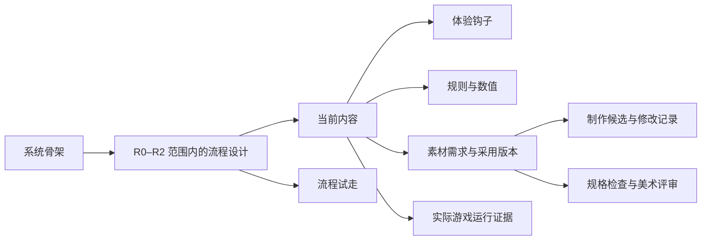

# 从 Scenario Skills 到 Spellcast 游戏开发工作台

调研日期：2026-09-26。Scenario 仓库核对版本：[`e0f5fc69f302f067ad2b75937990f0160e656369`](https://github.com/scenario-labs/skills/tree/e0f5fc69f302f067ad2b75937990f0160e656369)。

本文回答两个问题：这套资料能给 Spellcast 增加什么实际价值，还有哪些开源项目值得利用。**“来源事实”是本次读到的官方资料；“用于 Spellcast”是设计建议，尚未实现。** 本轮只进行研究和本地代码核对，未安装外部技能、执行其脚本、连接生成服务、调用付费模型或修改项目中的游戏内容。

## 一、先给结论

**最值得学的是让一个设计对象能够完成“提出需求、制作候选、对照修改、采用版本、进入游戏检查”这一整套操作。** Scenario 在素材生产这部分积累了很多具体经验；我们还需要把这些操作接回玩家流程、体验钩子、规则和数值。

进一步核对代码后，我将最初的“素材制作面板优先”调整为以下顺序：

1. **把现有流程步骤与设计对象连起来。** 选中一次玩家选择，能看到相关内容、体验钩子、规则和数值，并定位和编辑原对象。
2. **保存可追溯的方案比较。** 候选有独立基准；试走保留完整输入、变化和采用依据。相同的输入和选择意图遇到路径分歧时，显示具体原因。
3. **从这些步骤派生制作需求。** 再添加占位素材、制作候选、规格检查和版本采用，使制作结果有明确的使用位置。

调整依据来自当前源码：步骤尚无内容/钩子/规则的直接引用；试走只保留当前和上一次；来源失效判断比较整个对象。先处理这些连接与保存问题，素材制作面板才能接到完整的设计过程。后文保留素材面板与工具接入的具体建议，但它们属于后续阶段。

随后完成的 [Claude max 独立评审与主任务复核](G:/VibeProj/spellcast/docs/research/claude-workbench-review-2026-09-26.md)支持这个顺序调整，并记录了原文、代码依据及没有原样采纳的建议。

这能补上目前工作台的一段实用能力，同时保持我们已确认的结构：**稳定的系统骨架，在 R0–R2 范围内逐步叠加用户确认的内容、规则、钩子、数值及相关素材。** 具体内容以新的规划为准。原 Canvas 继续作为自由阅读、讨论和组合的入口。

## 二、Scenario 究竟开放了什么

它开放了按任务组织的技能说明、参考材料以及部分脚本和测试；仓库采用 MIT 许可证。图片、视频、音频、模型训练和工作流执行等操作大多通过 Scenario MCP 完成，需要账号及相应服务权限。开源技能本身不提供一个免费的本地生成后端。[README](https://github.com/scenario-labs/skills/blob/e0f5fc69f302f067ad2b75937990f0160e656369/README.md) · [LICENSE](https://github.com/scenario-labs/skills/blob/e0f5fc69f302f067ad2b75937990f0160e656369/LICENSE)

因此，利用它可以分三种方式：

| 方式 | 能得到什么 | 对我们当前的意义 |
|---|---|---|
| 借鉴工作方法 | 需求写法、参考图职责、候选比较、修正与交付标准 | 现在就能转成工作台的交互设计 |
| 选取脚本和模板 | 几何参考、精灵网格、文字叠层等明确输入输出的小工具 | 按真实素材需求逐个评估和验证 |
| 增加可选服务适配 | 使用 Scenario 的生成、分析和工作流服务 | 需要真实需求、账号、费用与产物回收机制 |

### 六项最值得吸收的做法

| 来源事实 | 用于 Spellcast 的具体操作 | 价值 |
|---|---|---|
| Identity Library 将角色需求、基准图、通过评审的视图和后续复用串起来。[来源](https://github.com/scenario-labs/skills/blob/e0f5fc69f302f067ad2b75937990f0160e656369/skills/scenario-identity-library/SKILL.md) | 在角色或道具上指定“当前采用的基准”，把候选与参考分开；从任何使用位置回到该版本。 | 解决同一角色反复生成后外观逐渐漂移的问题。 |
| Consistency 区分主体参考、风格参考和构图控制，要求保留基准并明确本次变化。[来源](https://github.com/scenario-labs/skills/blob/e0f5fc69f302f067ad2b75937990f0160e656369/skills/scenario-consistency/SKILL.md) | 编辑面板里分别放“必须保留”“本次修改”和参考材料，允许锁定已经确认的部分。 | 一次只改需要改的地方，减少整套内容被重做。 |
| Game Assets 检查透明边缘、实际边界、地面锚点和拼接；动画技能检查帧格、姿势与对齐。[素材](https://github.com/scenario-labs/skills/blob/e0f5fc69f302f067ad2b75937990f0160e656369/skills/scenario-game-assets/SKILL.md) · [动画](https://github.com/scenario-labs/skills/blob/e0f5fc69f302f067ad2b75937990f0160e656369/skills/scenario-sprite-animation/SKILL.md) | 在图像预览中切换背景、显示边界和锚点；动画能播放、逐帧看、检查首尾；规格检查显示测量结果。 | 把“看着像素材”推进到可检查的交付物。 |
| Refine Loop 先写可观察的标准，再诊断失败原因，选择局部修复，并限制迭代；Model Comparison 记录同一需求下的候选、实际费用和耗时。[迭代](https://github.com/scenario-labs/skills/blob/e0f5fc69f302f067ad2b75937990f0160e656369/skills/scenario-refine-loop/SKILL.md) · [比较](https://github.com/scenario-labs/skills/blob/e0f5fc69f302f067ad2b75937990f0160e656369/skills/scenario-model-comparison/SKILL.md) | 并排比较、圈选问题、只修选中部分；每次修改保留依据和结果，预算与尝试次数由当前任务决定。 | 减少无目的地反复生成。 |
| Shared Assets 用清单记录文件角色、几何、哈希、版本与上传后的引用。[来源](https://github.com/scenario-labs/skills/blob/e0f5fc69f302f067ad2b75937990f0160e656369/skills/scenario/references/shared-assets.md) | 产物记录来源、文件版本、制作输入和使用对象；替换前显示哪些地方受影响。 | 素材能追溯，项目也更容易搬家与恢复。 |
| Workflow Authoring 区分编辑图与发布后的执行图；运行前读取输入契约、检查并报价。[编写](https://github.com/scenario-labs/skills/blob/e0f5fc69f302f067ad2b75937990f0160e656369/skills/scenario-workflow-authoring/SKILL.md) · [运行](https://github.com/scenario-labs/skills/blob/e0f5fc69f302f067ad2b75937990f0160e656369/skills/scenario-workflows/SKILL.md) | 将常用制作步骤保存成模板；每次执行冻结输入和模板版本，结果回到发起它的游戏对象。 | 用户可以复用成功方法，并知道上次具体怎样完成。 |

### 仓库本身也有需要辨别的地方

- **seed 的表述不完全一致。** Game Assets 将复用 seed 列为低成本一致性手段，Consistency 则强调它不能保证不同提示词之间的身份一致。我们应记录 seed 用于追踪，并以共同基准和实际检查判断一致性，不把它写成保证。
- **自动评分有明确边界。** Quality Gate 是面向图像的 Enterprise 附加服务，文档也列出了结构和参考一致性等漏判情况。已有评估可以读取；没有已有结果时，普通调用可能启动收费分析。它适合提供评审意见，不能自动产生“游戏里验证通过”的结论。[Quality Gate](https://github.com/scenario-labs/skills/blob/e0f5fc69f302f067ad2b75937990f0160e656369/skills/scenario-quality-gate/SKILL.md)
- **不同工具的工作流格式并不通用。** Scenario 文档明确要求对其他节点编辑器的图逐节点翻译。我们可以引用外部流程文件和运行结果，但不应承诺任意图无损导入。[迁移说明](https://github.com/scenario-labs/skills/blob/e0f5fc69f302f067ad2b75937990f0160e656369/skills/scenario-workflow-authoring/SKILL.md)

## 三、与我们现有实现怎样连接

本次核对了当前源码，而不只依赖之前的功能总结：

| 当前代码事实 | 仍需补足的连接 |
|---|---|
| 已有 system、rule、hook、parameter、content、flow 六种规划类型，以及归属、使用、依赖、先后关系。[代码](G:/VibeProj/spellcast/src/project-planning-model.ts) | 素材需求和版本应引用这些对象；展示时可以出现在相应节点旁。 |
| 规则和钩子有专门字段；参数含当前值、范围、公式文本和候选值。 | 自由文字规则和公式文本不能自动当作可执行逻辑；需要明确的计算模型或外部适配。 |
| 流程支持类型化变量、条件比较、设值/加减、手动结果及输入和来源快照。[代码](G:/VibeProj/spellcast/src/game-flow-model.ts) | 可以继续做同一输入下的方案对照；概率、复杂公式、经济模拟要等明确需求再定义。 |
| 通用来源引用只有 label、uri、version；项目导出将外部文件标为 original_included=false。[代码](G:/VibeProj/spellcast/src/project-record-api.ts) | 当前引用还不等于素材文件已备份。以后需要区分“仅链接”“本地托管副本”“打包带走”。 |

**应当复用的是对象身份、引用、草稿、锁定、历史和现有图表组件。** 素材候选、制作执行和检查结果则需要表达自己的数据，不能都塞进一段正文或共用一个“完成”状态。

### “叠加”在界面里应该长什么样

上图表达建议的结构，不表示真实 R0–R2 设计已经填充。按照这一结构，关系在同一工作空间中可见。选中内容时，打开对应面板；切换到系统图时，仍看到它属于哪里、用到了什么。图上的位置只负责展示，内容与引用仍由同一份项目数据保存。

需要保持清楚的两种流程是：

- **玩家流程**：玩家看见什么、做什么选择、触发哪些规则、获得什么反馈。
- **制作流程**：制作需求、参考材料、生成或编辑、切片或转换、检查、采用与导出。

两种流程通过目标对象和结果关联，各自保存自己的执行语义。使用同一个绘图库，不意味着它们可以共用同一套节点含义。

### 建议的制作面板

- **左侧可收起**：当前位置、对象关系和使用处。
- **中间占主要窗口**：参考与候选并排，支持多选、原尺寸查看、同步缩放、动画播放或音频试听；不在画布小卡片里完成精细编辑。
- **右侧可收起**：需求、规格、保留项、本次变化、检查结果和采用理由。
- **底部按需展开**：版本、制作步骤和运行记录。

画布卡片展示摘要、缩略图和关键问题；双击或“进入编辑”打开大工作区。游戏开发与原 Canvas 可以展示同一个对象的引用，不复制出第二份需要分别维护的数据。

## 四、对钩子和数值也有用吗

**有用的是有依据的方案比较方法，素材生成模型本身不能代替游戏规则。**

假设需要讨论“新手第一次探索为什么值得继续”，工作台可以让我们：

1. 在钩子上写清玩家看到的线索、预期动作、回报和继续理由。
2. 找到与它关联的规则及数值，明确哪些已有、哪些待定。
3. 从同一份输入建立 A/B 两个候选方案，只改变选定的参数或反馈。
4. 使用明确支持的规则试走，比较路线、变量变化和阻断原因；规则未定义的部分显示为未知或手动输入。
5. 采用方案时查看差异和引用影响，保留另一个方案与讨论依据。
6. 在真实游戏测试后附上证据，检查预期反馈是否出现。

这与 Scenario 的共同之处是“基准、变化、比较、依据和采用”。**不能把美术评审分数换个名字，就当成好玩程度或数值平衡的证明。**

## 五、仓库里容易漏掉的三个小宝藏

这些比一次接入几十个模型更容易做成边界清楚的小能力。下表是源码阅读结果，尚未执行验证。

| 资源 | 输入与输出 | 适合我们怎样利用 |
|---|---|---|
| [等距模板脚本](https://github.com/scenario-labs/skills/blob/e0f5fc69f302f067ad2b75937990f0160e656369/skills/scenario-game-assets/scripts/build_isometric_templates.py) | 输出几类底座参考、区域图、汇总图及含哈希的清单；依赖 Pillow。 | 有真实等距素材需求时，提供可测量的地面范围和摆放锚点。 |
| [精灵网格模板](https://github.com/scenario-labs/skills/blob/e0f5fc69f302f067ad2b75937990f0160e656369/skills/scenario-sprite-animation/scripts/build_grid_templates.py) | 根据模板定义输出网格、对齐指南 PNG 和清单；依赖 Pillow。 | 让帧数、格尺寸和对齐成为明确输入，供制作和交付检查使用。 |
| [文字叠层脚本](https://github.com/scenario-labs/skills/blob/e0f5fc69f302f067ad2b75937990f0160e656369/skills/scenario-text-overlay/scripts/overlay.py) | JSON 输入生成透明文字 PNG；使用 Pillow、chevron，富文本还需 Chromium。 | 需要烘焙文字图片的交付物可参考其实现；可编辑 UI 文字仍保留为文字。 |

仓库还为脚本提供了[测试目录](https://github.com/scenario-labs/skills/tree/e0f5fc69f302f067ad2b75937990f0160e656369/tests)。真正复用前应选定文件版本，核对依赖和许可证，并用我们的实际输入检验输出；有测试目录不代表我们已经验证过。

## 六、其他值得挖的宝藏

这里按对 Spellcast 的作用排序，不按热度排序。

### 1. CastleDB：最值得借鉴的数值与引用编辑方式

**来源事实：** 表有数据模型，可以引用其他表的行，模型和数据保存为易于比较的 JSON。原独立编辑器已经标为 legacy，编辑功能转入 HIDE。仓库采用 ISC 许可证。[官方仓库](https://github.com/ncannasse/castle) · [许可证](https://github.com/ncannasse/castle/blob/master/LICENSE)

**用于 Spellcast：** 数值表里选择一个效果时直接引用效果对象；发现悬空引用时定位到具体单元格；改名不破坏关系；修改共享值时显示受影响的对象。现有 Tabulator 和 SQLite 足以承载这些交互，先借方法即可。

**我的判断：** 它对我们讨论技能、效果、奖励和内容依赖的长期价值，可能高于再增加一批生成模型。

### 2. LDtk：语义数据与视觉展示如何配合

**来源事实：** 实体字段有类型与约束；IntGrid 与自动图层规则把语义格子映射为视觉内容；项目可读取结构化 JSON。编辑器采用 MIT 许可证。[实体字段](https://ldtk.io/docs/general/editor-components/entities/) · [自动图层](https://ldtk.io/docs/general/auto-layers/auto-layer-rules/) · [加载数据](https://ldtk.io/docs/game-dev/loading/) · [许可证](https://github.com/deepnight/ldtk/blob/master/LICENSE)

**用于 Spellcast：** 借鉴“入口数量”“目的地存在”“字段取值范围”这样的直接检查，以及选中对象就能看到语义字段的交互。若以后真有二维地图来源，再做可选导入。

**边界：** LDtk 的二维关卡模型不应决定我们所有系统和流程的结构。

### 3. Ink / inkjs：可以实际复用的叙事运行时

**来源事实：** inkjs 提供 JavaScript/TypeScript 的故事运行时与编译能力，可以逐段执行、读取选项和变量；Ink 与 inkjs 使用 MIT 许可证，编译产物与运行时存在版本兼容要求。[inkjs](https://github.com/y-lohse/inkjs) · [inkjs 许可证](https://github.com/y-lohse/inkjs/blob/master/LICENSE.md) · [Ink](https://github.com/inkle/ink)

**用于 Spellcast：** 当真实需求出现 NPC 对话或文本遭遇时，让用户编辑脚本、立即选择分支、查看变量，并把对话节点与已有流程对象关联。

**边界：** 它可以负责一段叙事的执行；战斗、成长、经济仍由各自的规则和运行环境负责。

### 4. ComfyUI + 官方模板：可选制作工具与可复用配方

**来源事实：** ComfyUI 提供本地 API 与工作流 JSON；官方模板描述所需模型和节点，部分节点调用付费在线服务。核心仓库为 GPLv3，模板仓库为 MIT；具体模型和其他节点需分别核对。[ComfyUI](https://github.com/Comfy-Org/ComfyUI) · [模板规范](https://github.com/Comfy-Org/workflow_templates/blob/main/docs/SPEC.md) · [模板许可证](https://github.com/Comfy-Org/workflow_templates/blob/main/LICENSE) · [在线节点示例](https://docs.comfy.org/tutorials/partner-nodes/openai/dall-e-3)

**用于 Spellcast：** 有现成 ComfyUI 环境时，先关联流程文件、输入、产物及依赖版本，随后才考虑提交任务。用户从内容对象发起制作，完成后在同一对象下比较结果。

**边界：** 找到一个模板，并不意味着本机已具备相应模型、节点、显存或服务权限。第一步不需要把完整 ComfyUI 编辑器嵌进 Spellcast。

### 5. Kenney：尽快把玩法原型做出来

**来源事实：** Kenney 官方说明，资产页面上的游戏素材采用 CC0，可用于商业项目，无需署名。该说明的范围是这些素材，不包括其标志和全部产品。[官方说明](https://kenney.nl/support) · [素材目录](https://kenney.nl/assets)

**用于 Spellcast：** 在当前内容上挂接可用的占位素材，记录来源和本地文件，尽快看清界面、反馈及流程是否成立。后续替换正式美术时，保留使用关系。

**我的判断：** 对独立开发者，现成占位素材能让很多设计问题更早暴露，应该与生成素材具有同等入口。

### 6. glTF-Validator / glTF Transform：交付物的实际检查

**来源事实：** Khronos glTF-Validator 检查 glTF/GLB 的规范及资源结构，并输出 JSON 问题和统计报告，采用 Apache-2.0；glTF Transform 提供模型检查与转换工具，采用 MIT。[Validator](https://github.com/KhronosGroup/glTF-Validator) · [Transform](https://gltf-transform.dev/) · [Transform 仓库](https://github.com/donmccurdy/glTF-Transform)

**用于 Spellcast：** 出现真实 3D 交付需求时，导入文件即附带可定位的问题报告；优化结果保存为新版本，保留原文件。

**边界：** 格式通过只能证明相应结构检查通过；美术效果、碰撞、动画和游戏中的表现需要其他证据。当前没有相应素材任务时可以后做。

### 两项补充参考

- **Yarn Spinner**：核心编译器和命令行工具可用于对话结构诊断，ysc 支持图导出。核心为 MIT，但部分引擎集成采用 YSPL；应按实际组件选用。Story Solver 官方仍标为封闭 alpha，本轮不将其列为现成开源组件。[核心](https://github.com/YarnSpinnerTool/YarnSpinner) · [ysc](https://github.com/YarnSpinnerTool/YarnSpinner-Console) · [YSPL](https://yarnspinner.dev/yspl) · [Story Solver](https://yarnspinner.dev/storysolver/)
- **LibreSprite**：可以作为外部像素画编辑器，Spellcast 关联其图像、精灵图与元数据输出；项目为 GPLv2。先支持产物往返即可。[官方仓库](https://github.com/LibreSprite/LibreSprite)

## 七、建议先完成哪一小段

### 第一段：把一次玩家选择的设计、试走和采用连接起来

用一个明确标记的示例，或用户已经确认的 R0–R2 内容，验证以下动作：

1. 从系统图进入一个已有流程步骤，关联对应内容、钩子和规则，并能双向定位原对象。
2. 在步骤中看到“玩家获得什么线索、可以做什么、预计得到什么反馈”；未定义的规则和未知输入明确保留。
3. 建立一个有基准版本的数值候选，仅改变选定的值，保持当前采用值和其他内容不变。
4. 用相同初值和选择意图进行两次试走，比较实际采用的规则及变量变化；若某个选择在候选中不可用，显示分歧位置和条件。
5. 保存完整轨迹与讨论依据，采用候选时检查差异、引用影响、对象锁定与版本冲突。
6. 在继续试走、重开应用及项目导出/导入后，仍能找到这次比较的输入、路径和采用依据。

**验收重点：** 用户能从一个体验问题定位设计，改变一项内容，观察差异，再回到原对象。试走只验证明确建模的过程；钩子是否被玩家感知、理解和认可，需要另行观察，不能自动勾选为体验通过。

实现时先覆盖目前支持的比较与设值/加减。需要概率、曲线或复杂公式时，先定义规则，再添加执行器。来源的版本变化与执行含义变化应分别呈现；不要为了减少过期提示而丢弃来源记录。

### 第二段：由步骤派生制作需求，再比较素材候选

在具体步骤上记录需要的图标、角色、声音或其他素材，以及用途和规格。先允许挂接已有占位素材和人工导入的候选，再提供大窗口并排比较、问题标注、规格检查和采用操作。采用前显示引用影响，保留基准与旧版本。

素材文件放在本地用户数据或明确指定的素材位置，主动打包时才纳入。外部链接、本地副本和实际包含文件的导出分别显示。

### 第三段：挑一个制作动作接入已有工具

按真实需求选择一个，例如“切分并预览精灵动画”或“从固定参考制作一组图标”。模板明确输入、允许变化、输出和检查项。执行记录保存目标对象版本、参数、参考文件、工具版本、任务 ID 和费用信息；中断后可以查询已提交任务，避免把一次超时当作重新购买一次生成。账号凭据继续与项目导出分开。

### 后续按实际需求补充

| 出现的需求 | 再引入的能力 |
|---|---|
| 大量 NPC 对话或文本分支 | inkjs，或明确选择的对话工具适配 |
| 真正的二维关卡数据 | LDtk 等格式适配 |
| 有本地生成环境且经常复用配方 | ComfyUI 的任务提交和产物回收 |
| 稳定的 3D 资产交付 | glTF 检查与优化报告 |
| 存在明确的随机经济规则与分析问题 | 批量试验、分布和敏感性比较 |

## 八、技术取舍与研究边界

当前 Tauri、TypeScript、Rust、SQLite 以及 X6、Tabulator、ECharts 的组合能够承载对象编辑、并排比较、局部预览、任务状态和检查报告。图形制作、叙事执行、素材检查与游戏运行分别交给适合的组件或进程，并把结果关联回来，是可行的扩展方向。

目前更需要打通的是对象、文件、候选、采用版本和检查结果之间的关系。继续增加工具数量之前，先让这一条关系在界面里可见、可操作、可恢复。

本轮判断基于公开资料和现有源码，尚未证明这些外部组件在 Spellcast 中完成集成，也没有验证 VESPERIX 的游戏体验。没有导入旧游戏配置，没有将示例当作新 R0–R2 的真实设计，也没有自动建立付费服务或安装新的技能。

**调整后的建议：下一步优先完成“流程步骤 → 对应设计对象 → 候选试走 → 比较与采用”，随后增加由步骤派生的制作需求和素材候选。** 这样新增的每个工具，都能帮助完成具体游戏内容，并留下之后可继续修改的结果。
